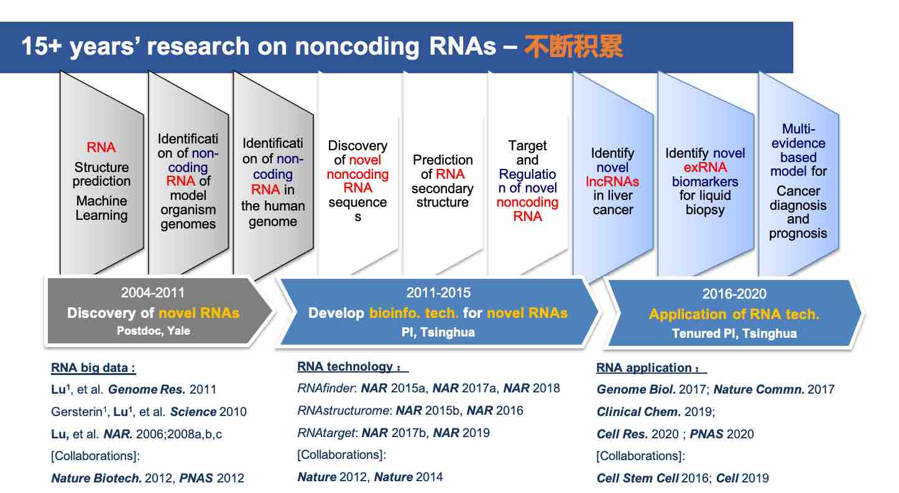

# About Us

## 清华大学・鲁志实验室简介

鲁志实验室（实验室主页： [http://lulab.life.tsinghua.edu.cn](http://lulab.life.tsinghua.edu.cn)）下属于清华大学生命科学学院，实验室成员包括博士生10余名和本科实习生若干，来自生物学、统计学、计算机科学等多学科。实验室依托于“生物信息学教育部重点实验室”和清华大学“合成与系统生物学研究中心”，拥有很好的人才支撑、硬件平台和合作科研环境。

实验室致力于**生物信息学**研究，利用高通量测序，结合机器学习和人工智能技术，来研究遗传信息是如何被编码在结构化的DNA和RNA分子之中，以及它们是如何在一个生命体系中相互作用、彼此调控。“上工治未病”，我们的使命之一，就是要帮助人们更早期的发现癌症。我们相信，这种使命感以及为此付出的实践和努力，将帮助我们理解和治疗人类疾病，并最终认识和提高我们自己。

实验室负责人鲁志博士 ([个人官方主页](http://life.tsinghua.edu.cn/info/1048/1412.htm))，清华大学生命科学学院研究员、博士生导师，教育部"长江学者“青年项目、国家基金委“优秀青年”基金、“霍英东”青年基金获得者。鲁志博士10余年来一直致力于非编码RNA相关的生物信息学研究，发表国际重要期刊文章60篇 ([Pulibcation List](https://www.ncrnalab.org/publications))，包括通讯作者文章近 30 篇(影响因子 10 分以上的 12 篇)；􏰍文章所发表期刊包括 *Science, Nature, Cell, PNAS, Genome Biology, Nature Communications*等，总引用近 15,000 次。我们针对RNA的10余年研究经验和主要成果如下图所示：

 

## 寻求合作

* [清华大学鲁志实验室**"癌症检测"**科研项目寻求合作](../open)
* [清华大学鲁志实验室**"siRNA治疗"**科研项目寻求合作](../open/#proj2)

 

## 专利和科研论文

**相关专利**

* 基于机器学习的生物信息方法RNAfinder（**专利号：201610806928.8**）(*Science* 2010; *Genome Res.* 2011; *Nucleic Acids Res.* 2015;2017a;2018)
* 癌症相关的RNA数据库（**著作权号：2016R11S367236**）(*Genome Biology* 2017; *Nucleic Acids Res.* 2017b;2019)
* 针对肝癌早期检测和复发监测的一个新型非编码exRNA标志物（**专利号:201811009464.3**）(*Nature Comminications* 2017; *Clinical Chemistry* 2019)
* 超微量RNA捕获和测序技术i-SMART (**专利申请号：201810607652X**）(*Briefings in Bioinformatics* 2018; *Cell Research* 2020)
* 体液样本中鉴定新型exRNA生物标志物的机器学习方法 (**专利申请号：202010618721.4**)（*Theranostics* 2020)
* 一种用于肝细胞癌早期筛查和复发监测的系统 (**专利申请号：202010927225.7**)（*Theranostics* 2020)

**代表性通讯论文**

* Shuaishuai Teng1, Yang Eric Li1, Ming Yang, Rui Qi, Yiming Huang, Qianyu Wang, Yanmei Zhang, Shanwen Chen, Shasha Li, Kequan Lin, Yang Cao, Qunsheng Ji, Qingyang Gu, Yujing Cheng, Zai Chang, Wei Guo, Pengyuan Wang, Ivan Garcia-Bassets, **Zhi John Lu**\* and Dong Wang\* (2020) Tissue-specific transcription reprogramming promotes liver metastasis of colorectal cancer. **_Cell Research_** 30(1):34-49 (1contributed equally, \*co-corresponding authors) (IF:20.5)
* Yang Eric Li1, Mu Xiao1, Binbin Shi1, Yu-Cheng T. Yang, Dong Wang, Fei Wang, Marco Marcia and **Zhi John Lu*** (2017) Identification of high-confidence RNA regulatory elements by combinatorial classification of RNA-protein binding sites. **_Genome Biology_** 18:169 (1contributed equally) (IF: 14)
* Yang Yang1, Lei Chen1, Jin Gu1, Hanshuo Zhang1, Jiapei Yuan, Qiuyu Lian, Guishuai Lv, Siqi Wang, Yang Wu, Yu-Cheng T. Yang, Dongfang Wang, Yang Liu, Jing Tang, Guijuan Luo, Yang Li, Long Hu, Xinbao Sun, Dong Wang, Mingzhou Guo, Qiaoran Xi, Jianzhong Xi, Hongyang Wang\*, Michael Q. Zhang\* and **Zhi John Lu*** (2017) Recurrently deregulated lncRNAs in hepatocellular carcinoma. **_Nature Communications_** 8, 14421 (1 contributed equally, \* co-corresponding) (IF: 12)
* Yu-Xiang Chen1, Zhi-yu Xu1, Xueliang Ge, Suparna Sanyal, **Zhi John Lu**\* and Babak Javid\* (2020) Selective translation by alternative bacterial ribosomes. ***PNAS*** 117(32):19487-19496 (1contributed equally, \*co-corresponding authors) (IF:9.4)
* Yumin Zhu1, Siqi Wang1, Xiaochen Xi1, Minfeng Zhang1, Xiaofan Liu, Weina Tang, Peng Cai, Shaozhen Xing, Pengfei Bao, Yunfan Jin, Weihao Zhao, Yinghui Chen, Huanan Zhao, Xiaodong Jia, Shanshan Lu, Yinying Lu, Lei Chen\*, Jianhua Yin\*, **Zhi John Lu**\* (2021) Integrative analysis of long extracellular RNAs reveals a detection panel of noncoding RNAs for liver cancer. ***Theranostics*** 11(1):181-193 (1contributed equally, \*co-corresponding authors)  (IF: 8.6)

**代表性合作论文**

* Gerstein MB 1\*, **Lu ZJ**1, Van Nostrand EL1, Cheng C1, Arshinoff BI1, et al. (2010) Integrative analysis of the _Caenorhabditis elegans_ genome by the modENCODE project. **_Science_** 330(6012): 1775-1787 (120 co-first authors, \* 15 co-corresponding authors, ~150 authors in total) [Cover Story]

* Rui Xiao, Jia-Yu Chen, Zhengyu Liang, Daji Luo, Geng Chen, **Zhi John Lu**, Yang Chen, Bing Zhou, Hairi Li, Xian Du, Yang Yang, Mingkui San, Xintao Wei, Wen Liu, Eric Lecuyer, Brenton R. Graveley, Gene W. Yeo, Christopher B. Burge, Michael Q. Zhang, Yu Zhou and Xiang-Dong Fu (2019) Pervasive Chromatin-RNA Binding Protein Interactions Enable RNA-Based Regulation of Transcription. **_Cell_** 178, 107–121

* ENCODE Project Consortium#. (2012) An Integrated Encyclopedia of DNA Elements in the Human Genome. **_Nature_** 489, 57–74\. (#**Lu Z** is part of ENCODE Consortium) [Cover Story]

* Gerstein MB, Joel Rozowsky, Koon-Kiu Yan, …, **Lu Z,** …, Robert Waterston (2014) Comparative Analysis of the Transcriptome across Distant Species. **_Nature_** 512(7515):445-448.

  

 

## 在研项目

*	国家自然科学基金面上项目，81972798，针对癌症诊断和预后的新型体液exRNA标志物的研究，
  2020-2023		主持
*	国家自然科学基金面上项目，31771461，RNA二级结构预测算法研究，
  2018-2021		主持
*	清华大学自主科研计划，20197030006，液体活检中超微量RNA新型检测方法的研发，     2019-2020	主持
*	北京市高精尖结构生物学中心竞争性项目， RNA二级结构预测新方法的开发和研究，2017-2020	主持
*	国家科技部重点研发计划，2016YFA0500803，植物中新非编码RNA及其靶标的系统发现和解析，2016/07-2021/06	课题负责人 （生物信息组）
*	北京市高精尖结构生物学中心竞争性项目， 植物免疫中的RNA动态结构研究，2020/07-2023/06	主持

