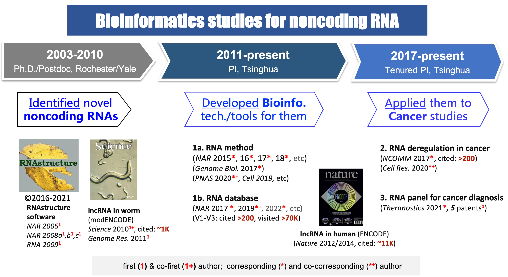
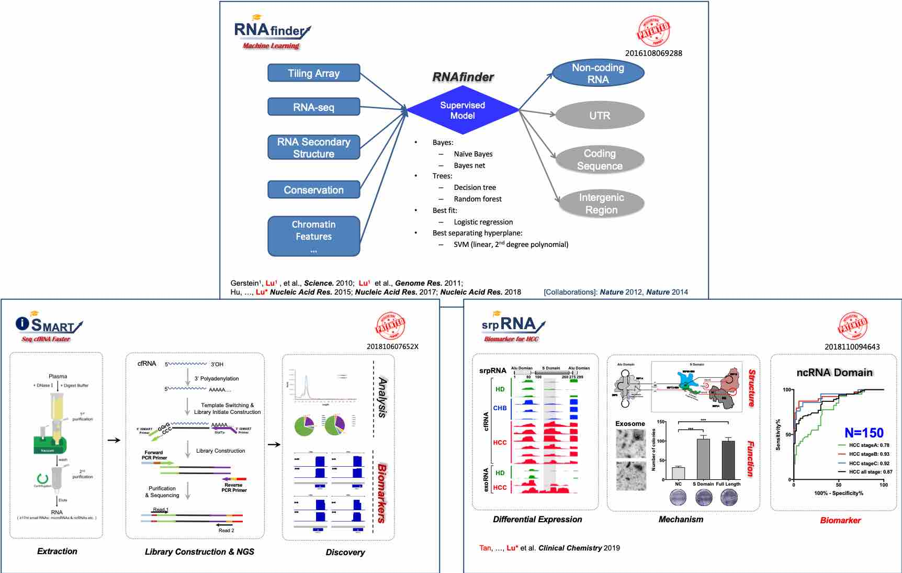

# 清华大学・鲁志实验室科研项目及其转化寻求合作

**目录：**

* TOC
{:toc}

---

## 实验室简介

鲁志实验室（实验室主页： [http://lulab.life.tsinghua.edu.cn](http://lulab.life.tsinghua.edu.cn)）下属于清华大学生命科学学院，实验室成员包括博士生10余名和本科实习生若干，来自生物学、统计学、计算机科学等多学科。实验室依托于“生物信息学教育部重点实验室”和清华大学“合成与系统生物学研究中心”，拥有很好的人才支撑、硬件平台和合作科研环境。

我们实验室致力于发展**生物信息学技术**，并探索其在癌症等复杂疾病的**精准医疗**上的具体应用。我们利用机器学习等**人工智能技术**，结合**多组学**数据，来研究遗传信息是如何被编码在结构化的DNA和RNA分子之中，以及它们是如何在一个生命体系中相互作用、彼此调控。
“上工治未病”，我们的一个重要使命，是帮助人们更早期的发现癌症。我们相信，这种使命感以及为此付出的实践和努力，将帮助我们理解和治疗人类疾病，并最终认识和提高我们自己。

实验室负责人鲁志博士 ([个人官方主页](https://cn.bing.com/search?q=%E6%B8%85%E5%8D%8E%E5%A4%A7%E5%AD%A6+%E7%94%9F%E5%91%BD%E5%AD%A6%E9%99%A2+%E9%B2%81%E5%BF%97))，清华大学生命科学学院副教授（tenured）、特别研究员、博士生导师，国家基金委“优秀青年”基金、某青年人才项目、“霍英东”青年基金获得者。鲁志博士近20年来一直致力于非编码RNA相关的生物信息学研究，发表国际重要期刊文章60余篇 ([Pulibcation List](https://www.ncrnalab.org/publications))，包括通讯作者文章30余篇(影响因子 10 分以上的 10余篇, ESI高被引论文3篇)；文章所发表期刊包括 *Science, Nature, Cell, PNAS, e-Life, Genome Biology*等，总引用超过2万次。**我们针对noncoding RNA的近20年的研究经验**和主要成果如下图所示：

## 代表性在研项目

* 国家自然科学基金 面上项目，3217040246，体液多组学数据整合的生物信息学研究及其在癌症无创检测上的应用，2022-2025		主持
* 国家自然科学基金 面上项目，81972798，针对癌症诊断和预后的新型体液exRNA标志物的研究，2020-2023		主持
* 国家“凤凰工程”  技术创新开放共享课题，2021-NCPSB-005，多组学整合的生物信息学研究，2021/07-2023/06	主持
* 北京市高精尖结构生物学中心 竞争性项目， 翻译调控中的 RNA结构研究，2020/07-2023/06	主持
* 清华大学国强研究院  人工智能与机器人项目，2021GQG1020，生物调控网络知识启发下的新型AI模型的构建及其在癌症早诊上的应用，2022/04-2024/03	主持
* 清华大学春风基金，2021Z99CFY022，针对微生物感染的新型核酸检测技术研发，2021/09-2023/09	主持

 

---

# 项目一：针对癌症等复杂疾病的核酸检测项目 - AI驱动的cfRNA检测技术

## 基本信息

- **招募机构：医院、临检机构、医药公司、癌症检测公司等**
- **合作课题和合作方式：**
- **合作发现和研究癌症早筛、早诊和预后中的新型体液标志物**
  - **我们提供相关试剂盒和检测方法的开发和生产方案**
  - **我们提供相关生物信息学分析和软件定制**
- **发起组织：清华大学生命学院鲁志实验室** （Lab of *RNA Bioinformatics*）
- **有效时间：长期**

## 研究目标和项目简介

* **研究目标**：

该癌症检测项目的目的是要为癌症早期筛查、早期诊断以及预后治疗寻找到更好（精准、重复性高、经济上利于普及大众、操作上简单无创）的新型体液标志物（exRNA/cfRNA），并标准化其检测和解析流程，开发出新的液体活检技术。**“上工治未病”，我们要帮助更多人更早地发现癌症。**

* **项目简介**：

本项目将基于基因组学和生物信息学，通过开发体液RNA微量测序技术和机器学习方法，在体液中发现和鉴定与癌症发生发展相关的新型exRNA标志物，应用于国内高致死癌症的早期诊断和预后辅助治疗。exRNA指的是胞外RNA，又称cfRNA，包括多种类型：miRNA,Y RNA,circRNA,lncRNA等。RNA标志物与DNA和蛋白标志物相比，具有更好的敏感性、组织特异性和多样性，为更好的临床检验带来了新的期望。我们在新型非编码RNA和生物信息学研究方面积累了丰富经验，基于此，我们将在癌症病人体液（如血液）中发现和分析标志癌症发生发展的新型exRNA/cfRNA，并整合现有标志物构建多重标志物的智能模型，在大样本上进行验证，建立具有更高精准度和可重复性的无创检验方法。

我们在非编码RNA(ncRNA)测序和生物信息学研究中积累了近20年的丰富经验，例如，我们在模式生物和肝癌样本中通过测序和生物信息学分析发现了很多新的lncRNA（*Science 2010; Nature 2012; Nature 2014; Genome Biology 2017; Cell 2019; Cell Research 2020; PNAS 2020*), 其中有不少具有很好的标志物特性。从2015年起，实验室开始大力发展针对体液无创检测技术的研究，我们已经克服了体液游离RNA易降解及微量建库的技术难题，开发了自主研发的超微量RNA测序技术i-SMART(专利号：201810607652X）和基于机器学习和人工智能的生物信息学方法RNAfinder（专利号：2016108069288）和exSEEK（专利申请号：202010618721.4）(*Genome Res. 2011; Nucleic Acids Res. 2015; Nucleic Acids Res. 2017a*)，发现了一些新的exRNA标志物（专利号:2018110094643；专利号：202010927225.7) (*Nature Communications 2017; Clinical Chemistry 2019; Theranositics 2021*)，积累了癌症相关的RNA数据库（著作权号：2016R11S367236）(*Nucleic Acids Res. 2017b; Nucleic Acids Res. 2019*；*Nucleic Acids Res.* 2022)，为癌症无创检测试剂的开发提供了有力的支持。

## 合作方式

### 1) 合作发表科研文章

**合作发现和研究体液中的新型exRNA/cfRNA，共同发表科研文章**

* **I期. 新型标志物的“发现和探索”阶段**
  * 贵单位构负责收集 **少量（30-50例血样）** 癌症病人和/或健康对照人群的血浆，妥善储存并运输；
  * 我们负责进行预实验和分析，实验和分析费用由我们承担。
* **II期. 新型标志物的“鉴定和验证”阶段**
  * 在前期预实验效果较好的前提下，还需要在 **大量样本（200-500例血样）** （最好部分血样能配套组织样本）中进行测序和验证；
  * 实验和分析费用由双方共同承担，具体合作事宜面议。

> 样本收集与临床队列设计:

---

### 2) 合作开发试剂盒和申请器械证

**我们提供相关试剂盒和检测方法的开发和生产方案**

* **III期. 新型标志物优化和试剂盒设计**
  * 我们负责从**前期科研成果**和**自有的液体活检生物标志物数据库**（**注1**）中**根据贵单位需求**筛选出证据等级和临床应用潜力较高的候选生物标志物，涵盖DNA，RNA，蛋白，代谢物等不同分子类型，我们将综合考虑标志物的一致性报道个数、已验证的样本数、生物学功能和诊断效果等；
  * 贵单位负责对筛选的标志物在**200-500例**癌症病人和健康对照人群的血浆样本中进行二次验证；
  * 我们负责对验证数据进行再分析，采用机器学习等人工智能方法优化出诊断模型，设计相应试剂盒；
  * 贵单位进行相应试剂盒生产和推广。
* **IV期. 大规模临床报证和产业化阶段**
  * 进行三类医疗器械证的注册、申报和推广，具体合作事宜面议，可以共同寻找其他投资和合作伙伴。

> **注1：**
>
> 我们已经构建了一个**包含 DNA，RNA，蛋白质和代谢物**的整合性液体活检生物标志物数据库。该数据库包括：
>
> * 获 FDA/CFDA 批准的近百个用于临床肿瘤诊断、指导用药和预后的生物标志物；
> * 从 上千篇已发表科研文献中手动收集的具有临床应用潜能的生物标志物；
> * 从公开发表的几千套液体活检高通量数据中鉴定出来的候选生物标志物。
>
> 我们的数据库涵盖了肺癌、乳腺癌、结直肠癌、肝癌、胰腺癌、胃癌、食管癌、脑胶质瘤、多发性骨髓瘤、前列腺癌、卵巢癌、肾癌、冠心病等**31种人类疾病**。同时，我们基于标志物的证据水平发展了一套**标志物分级系统**，给每一个标志物指定一个证据等级，帮助用户快速地认识所感兴趣的标志物的临床应用潜力。

---

### 3) 提供标志物发现和优化的实验方案

**我们提供体液中新型标志物的发现、鉴定和优化方法 - 实验方案**

我们在前期研究exRNA的过程中，参考最新的单细胞测序方法，摸索了一套可以从体液中高效率地捕获不同长度、不同类型的exRNA（又称为cfRNA）的实验流程。我们将根据**贵单位需求**开发相应试剂盒，可以帮助使用者从多种体液中进行exRNA/cfRNA的研究，涵盖了提取、纯化、捕获、扩增等一系列步骤的试剂及方法，可在1-2天内完成从体液获取到exRNA/cfRNA上机测序的全部准备，实用便捷。

> 包含small cfRNA/exRNA和total cfRNA/exRNA的全转录组捕获、富集和测序方案:

---

### 4) 提供标志物发现和优化的生信分析

**我们提供体液中新型标志物的发现、鉴定和优化方法 - 生物信息学分析和软件定制**。

我们在开展广泛应用于基因组学和癌症生物学的科学实践的同时，开发了一系列分析工具和平台。主要包括*RNAfinder、RNAtarget、RNAstructurome、RNAmed*四个系列:

* **a) *RNAfinder***
  * [Ribowave](https://github.com/lulab/Ribowave):  用于核糖体测序数据（Ribo-seq）的分析，利用小波变换模型来提取核糖体3-nt周期（即信号频率）来使原始信号去噪声化，并精确定位其足迹信息 (*Nucleic Acids Research* 2018)。
  * [COME](https://github.com/lulab/COME):  用于mRNA和lncRNA中蛋白编码潜能的分析 (*Nucleic Acids Research* 2017)。
  * [RNAfeature](https://github.com/lulab/RNAfeature): 用于多个物种间非编码RNA保守性信息的分析 (*Nucleic Acids Research* 2015)。
* **b) *RNAtarget***
  * [RBPgroup](https://github.com/lulab/RBPgroup): 利用NMF（非负矩阵分解）对各种CLIP-seq数据进行整合分析  (*Genome Biology*  2017)。
  * [POSTAR](http://lulab.life.tsinghua.edu.cn/postar): 一个探究RNA转录后调控事件的数据库和分析平台，能提供多个物种间RNA-蛋白的相互作用、致病突变位点等信息 (*Nucleic Acids Research* 2017/2019/2022)。
  * [CLIPdb](http://lulab.life.tsinghua.edu.cn/clipdb): 一个集成了各种类型CLIP-seq数据的数据库，描述RNA结合蛋白和各种RNA调控网络的集成资源数据库 (*BMC Genomics* 2015)。
* **c) *RNAstructurome***
  * [RME/RNAex](https://github.com/lulab/RME):  一种RNA二级结构预测算法，同时提供了多种类型的RNA二级结构实验数据 (*Nucleic Acids Research* 2015/2016)。
* **d) *RNAmed***
  * [CCG](http://lulab.life.tsinghua.edu.cn/ccg): 用于探究肿瘤中蛋白编码基因和非编码RNA的一个资源数据库  (*Discovery Medicine*, 2016)。
  * [exSeek](https://github.com/lulab/exSEEK): 用于整合分析和评估细胞外RNA作为生物标志物的计算框架。
  * [exMarker](http://lulab.life.tsinghua.edu.cn/exmarker/): 多类型生物标志物的整合数据库，也可以用来预测各种疾病患病可能性。

## 合作方资质需求和已有合作单位

具有收集癌症病人和/或健康对照人群体液和/或组织样品的资质 ，或具有试剂盒开发及推广经验和资质的机构及公司。

* **已有合作单位:**
  - **北京** 北京协和医院
  - **北京** 北京大学第一医院
  - **天津** 天津肿瘤医院
  - **上海** 海军军医大学
  - **成都** 华西医院
  - 。。。

## 相关专利

**相关专利**

1. 基于机器学习的生物信息方法RNAfinder（**专利号：201610806928.8**）(*Science* 2010; *Genome Res.* 2011; *Nucleic Acids Res.* 2015;2017a;2018)
2. 癌症相关的RNA数据库（**著作权号：2016R11S367236**）(*Genome Biology* 2017; *Nucleic Acids Res.* 2017b;2019)
3. 针对肝癌早期检测和复发监测的一个新型非编码exRNA标志物（**专利号:201811009464.3**）(*Nature Comminications* 2017; *Clinical Chemistry* 2019)
4. 痕量RNA捕获和测序技术i-SMART (**专利号：201810607652X**）(*Briefings in Bioinformatics* 2018; *Cell Research* 2020)
5. 一种用于肝细胞癌早期筛查和复发监测的系统 (**专利号：202010927225.7**)（*Theranostics* 2021)
6. 体液样本中鉴定新型exRNA生物标志物的机器学习方法 (**专利申请号：202010618721.4**)
7. 痕量RNA捕获和测序技术DETECTOR (**专利申请号：202210579444.X**)

 

---

# 项目二：RNA制药项目 - AI 驱动的RNA结构预测技术

## 基本信息

- **招募机构：医院和医药公司等**
- **合作课题：RNA制药在疾病治疗上的应用**  
- **合作方式**：
  - 通过 AI 技术筛选和优化针对**RNA结构**的小分子药物
  - 通过 AI 技术筛选和优化针对**RNA序列**的siRNA/shRNA
  - **合作方**提供Deliver RNA的方法  或者 提供靶标的疾病  
- **发起组织：清华大学生命学院鲁志实验室**（Lab of *RNA Bioinformatics*）
- **有效时间：长期**

## 研究目标

我们在RNA-蛋白结合，RNA-siRNA/shRNA结合的计算设计上积累了大量科研经验，并应用在了HIV、HCV等病毒的靶标筛选上。希望能应用在癌症治疗、病毒感染治疗等疾病治疗上。

## 项目简介

我们在RNA-protein interaction (***Nuc. Acids. Res. 2017, 2019, 2022***), RNA secondary structure prediction (***Nucleic Acids Res. 2006，RNA 2009, Nucleic Acids Res. 2015，2016***）, siRNA(Nucleic Acids Res. 2008a,b,c）和shRNA(***PNAS 2012***)的设计及其在靶标HIV、HCV等病毒的应用上取得了很多科研成果。

RNA-binding proteins (RBPs) play key roles in post- transcriptional regulation. Accurate identification of RBP binding sites in multiple cell lines and tissue types from diverse species is a fundamental en- deavor towards understanding the regulatory mech- anisms of RBPs under both physiological and patho- logical conditions. Our POSTAR annotation pro- cesses make use of publicly available large-scale CLIP-seq datasets and external functional genomic annotations to generate a comprehensive map of RBP binding sites and their association with other regulatory events as well as functional variants. Here, we present POSTAR3, an updated database with im- provements in data collection, annotation infrastruc- ture, and analysis that support the annotation of post-transcriptional regulation in multiple species in- cluding: we made a comprehensive update on the CLIP-seq and Ribo-seq datasets which cover more biological conditions, technologies, and species; we added RNA secondary structure profiling for RBP binding sites; we provided miRNA-mediated degra- dation events validated by degradome-seq; we included RBP binding sites at circRNA junction re- gions; we expanded the annotation of RBP binding sites, particularly using updated genomic variants and mutations associated with diseases. POSTAR3 is freely available at http://postar.ncrnalab.org.  — ***Nucleic Acids Res.* 2022**

shRNAs can trigger effective silencing of gene expression in mammalian cells, thereby providing powerful tools for genetic studies, as well as potential therapeutic strategies. Specific shRNAs can interfere with the replication of pathogenic viruses and are currently being tested as antiviral therapies in clinical trials. However, this effort is hindered by our inability to systematically and accurately identify potent shRNAs for viral genomes. Here we apply a recently developed highly parallel sensor assay to identify potent shRNAs for HIV, hepatitis C virus (HCV), and influenza. We observe known and previously unknown sequence features that dictate shRNAs efficiency. Validation using HIV and HCV cell culture models demonstrates very high potency of the top-scoring shRNAs. Comparing our data with the secondary structure of HIV shows that shRNA efficacy is strongly affected by the secondary structure at the target RNA site. Artificially introducing secondary structure to the target site markedly reduces shRNA silencing. In addition, we observe that HCV has distinct sequence features that bias HCV- targeting shRNAs toward lower efficacy. Our results facilitate further development of shRNA based antiviral therapies and improve our understanding and ability to predict efficient shRNAs.  — ***PNAS* 2012**

Small interfering RNA (siRNA) are widely used to infer gene function. Here, insights in the equilibrium of siRNA-target hybridization are used for selection of efficient siRNA. The accessibilities of siRNA and target mRNA for hybridization, as measured by folding free energy change, are shown to be significantly correlated with efficacy. For this study, a partition function calculation that considers all possible secondary structures is used to predict target site accessibility; a significant improvement over calculations that consider only the predicted lowest free energy structure or a set of low free energy structures. The predicted thermodynamic features, in addition to siRNA sequence features, are used as input for a support vector machine that selects functional siRNA. The method works well for predicting efficient siRNA (efficacy  70%) in a large siRNA data set from Novartis. The positive predic- tive value (percentage of sites predicted to be efficient for silencing that are) is as high as 87.6%. The sensitivity and specificity are 22.7 and 96.5%, respectively. When tested on data from different sources, the positive predictive value increased 8.1% by adding equilibrium terms to 25 local sequence features. — ***Nucleic Acids Res.* 2008a**

     

---

# 联系方式

| **地址：**     | **清华大学 生命科学学院，生物信息学“教育部重点实验室”， 北京，100084**                                                                                           |
|:----------- |:------------------------------------------------------------------------------------------------------------------------------------ |
| **办公电话：**   | **+86-10-62789217**                                                                                                                  |
| **E-mail：** | **lulab1 AT tsinghua.edu.cn**                                                                                                        |
| **实验室主页：**  | **[http://lulab.life.tsinghua.edu.cn](http://lulab.life.tsinghua.edu.cn)** \| **[http://www.ncrnalab.org](http://www.ncrnalab.org)** |
