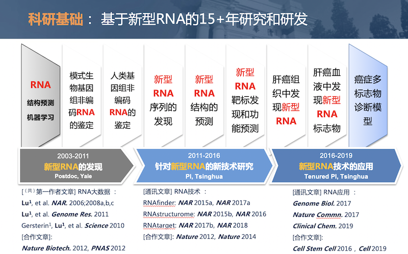

# 清华大学鲁志实验室siRNA科研项目寻求合作

---

## 基本信息

- **起止日期：长期招募**
- **合作课题：RNA在疾病治疗上的应用**  
- **发起组织：清华大学生命学院鲁志实验室**  
- **有效时间：长期**

## 研究目标

我们之前在siRNA和shRNA的设计及其针对HIV、HCV等病毒的靶标筛选上积累了大量科研经验。希望能应用在癌症治疗、病毒感染治疗等疾病治疗上。

## 实验室简介

  鲁志实验室（[实验室主页](http://www.ncrnalab.org)）隶属清华大学生命科学学院，实验室成员包括博士生10余名和本科实习生若干，来自生物学、统计学、计算机科学等多学科。本实验室已经建立了项目所需要的基本分子实验平台和计算平台，同时也依托于“生物信息学教育部重点实验室”和清华大学“合成与系统生物学研究中心”，拥有很好的人才支撑、硬件平台和合作科研环境。

  本实验室属于交叉科学实验室，致力于发展生物信息学技术，并探索能够广泛应用于基因组学和癌症生物学的医学实践。我们利用高通量测序，结合机器学习和人工智能技术，来研究遗传信息是如何被编码在结构化的DNA和RNA分子之中，以及它们是如何在一个生命体系中相互作用、彼此调控。我们相信，这种使命感以及为此付出的实践和努力，将帮助我们理解和治疗人类疾病，并最终认识和提高我们自己。

> 实验室负责人鲁志([个人官方主页](http://life.tsinghua.edu.cn/info/1048/1494.htm))博士，清华大学生命科学学院 研究员，博士生导师，教育部"长江学者“青年项目、国家基金委“优秀青年”基金、“霍英东”青年基金获得者。鲁志博士10余年来一直致力于非编码RNA相关的生物信息学研究，发表国际重要期刊文章近60篇([Pulibcation List](https://www.ncrnalab.org/publications)),包括Science, Genome Res., Genome Biology, Nature Communications, Nucleic Acids Research 等, 总引用超过10,000 次（[Google Scholar Site](https://scholar.google.com/citations?user=wrtnAbEAAAAJ&hl=en))；其中，近5年的通讯作者文章20余篇（影响因子10分以上的10余篇）。

## 项目简介

我们在RNA二级结构预测(Nucleic Acids Res. 2006，RNA 2019, Nucleic Acids Res. 2015，2016）siRNA(Nucleic Acids Res. 2008a,b,c）和shRNA(PNAS 2012)的设计及其在靶标HIV、HCV等病毒的应用上取得了很多科研成果。

Small interfering RNA (siRNA) are widely used to infer gene function. Here, insights in the equilibrium of siRNA-target hybridization are used for selection of efficient siRNA. The accessibilities of siRNA and target mRNA for hybridization, as measured by folding free energy change, are shown to be significantly correlated with efficacy. For this study, a partition function calculation that considers all possible secondary structures is used to predict target site accessibility; a significant improvement over calculations that consider only the predicted lowest free energy structure or a set of low free energy structures. The predicted thermodynamic features, in addition to siRNA sequence features, are used as input for a support vector machine that selects functional siRNA. The method works well for predicting efficient siRNA (efficacy  70%) in a large siRNA data set from Novartis. The positive predic- tive value (percentage of sites predicted to be efficient for silencing that are) is as high as 87.6%. The sensitivity and specificity are 22.7 and 96.5%, respectively. When tested on data from different sources, the positive predictive value increased 8.1% by adding equilibrium terms to 25 local sequence features. Prediction of hybridization affi- nity using partition functions is now available in the RNAstructure software package. — ***Nucleic Acids Res.* 2008a**

shRNAs can trigger effective silencing of gene expression in mammalian cells, thereby providing powerful tools for genetic studies, as well as potential therapeutic strategies. Specific shRNAs can interfere with the replication of pathogenic viruses and are currently being tested as antiviral therapies in clinical trials. However, this effort is hindered by our inability to systematically and accurately identify potent shRNAs for viral genomes. Here we apply a recently developed highly parallel sensor assay to identify potent shRNAs for HIV, hepatitis C virus (HCV), and influenza. We observe known and previously unknown sequence features that dictate shRNAs efficiency. Validation using HIV and HCV cell culture models demonstrates very high potency of the top-scoring shRNAs. Comparing our data with the secondary structure of HIV shows that shRNA efficacy is strongly affected by the secondary structure at the target RNA site. Artificially introducing secondary structure to the target site markedly reduces shRNA silencing. In addition, we observe that HCV has distinct sequence features that bias HCV- targeting shRNAs toward lower efficacy. Our results facilitate further development of shRNA based antiviral therapies and improve our understanding and ability to predict efficient shRNAs.  — ***PNAS* 2012**

> 针对新型RNA的10余年研究经验和主要成果
> 

## 合作方资质需求

* 可以提供Deliver RNA的方法  

* 可以提供靶标的疾病  

## 相关代表性论文

* **Lu ZJ**, Mathews DH. (2008) Efficient siRNA selection using hybridization thermodynamics.***Nucleic Acids Research*** 36:640-647. (IF: 11)
* **Lu ZJ**, Mathews DH. (2008) OligoWalk: an online siRNA design tool utilizing hybridization thermodynamics. ***Nucleic Acids Research*** 36:W104-W108. (IF: 11)
* **Lu ZJ**, Mathews DH. (2008) Fundamental differences in the equilibrium considerations for siRNA and antisense oligodeoxynucleotide design. ***Nucleic Acids Research*** 36:3738-3745. (IF: 11)
* Tan X, **Lu ZJ**2, Gao G, Xu QK, Hu L2, Fellmann C, Li MZ, Qu HJ, Lowe SW, Hannon GJ & Elledge SJ. (2012) Tiling genomes of pathogenic viruses identifies potent antiviral shRNAs and reveals a role for secondary structure in shRNA efficacy. ***Proc. Natl. Acad. Sci. U. S. A.***, 109(3):869-74. (2 Lu Lab, School of Life Sciences, Tsinghua University) (IF: 10)
* Tan X, Hu L2, Luquette JL, Gao G, Liu YF2, Qu HJ, Xi RB, **Lu ZJ**2, Park PJ & Elledge SJ. (2012) Systematic Identification of Synergistic Drug Pairs Targeting HIV. ***Nature Biotech*** 30:1125-1130. (2Lu Lab, School of Life Sciences, Tsinghua University) (IF: 36)
* Shuaishuai Teng1, Yang Eric Li1, Ming Yang, Rui Qi, Yiming Huang, Qianyu Wang, Yanmei Zhang, Shanwen Chen, Shasha Li, Kequan Lin, Yang Cao, Qunsheng Ji, Qingyang Gu, Yujing Cheng, Zai Chang, Wei Guo, Pengyuan Wang, Ivan Garcia-Bassets, **Zhi John Lu**\* and Dong Wang\* (2020) Tissue-specific transcription reprogramming promotes liver metastasis of colorectal cancer. **_Cell Research_** 30(1):34-49 (1contributed equally, \*co-corresponding authors)(IF:18)
* Yang Yang1, Lei Chen1, Jin Gu1, Hanshuo Zhang1, Jiapei Yuan, Qiuyu Lian, Guishuai Lv, Siqi Wang, Yang Wu, Yu-Cheng T. Yang, Dongfang Wang, Yang Liu, Jing Tang, Guijuan Luo, Yang Li, Long Hu, Xinbao Sun, Dong Wang, Mingzhou Guo, Qiaoran Xi, Jianzhong Xi, Hongyang Wang\*, Michael Q. Zhang\* and **Zhi John Lu*** (2017) Recurrently deregulated lncRNAs in hepatocellular carcinoma. **_Nature Communications_** 8, 14421 (1 contributed equally, \* co-corresponding) (IF: 12)
* Yang Eric Li1, Mu Xiao1, Binbin Shi1, Yu-Cheng T. Yang, Dong Wang, Fei Wang, Marco Marcia and **Zhi John Lu*** (2017) Identification of high-confidence RNA regulatory elements by combinatorial classification of RNA-protein binding sites. **_Genome Biology_** 18:169 (1contributed equally) (IF: 14)

## 代表性合作

* Rui Xiao, Jia-Yu Chen, Zhengyu Liang, Daji Luo, Geng Chen, **Zhi John Lu**, Yang Chen, Bing Zhou, Hairi Li, Xian Du, Yang Yang, Mingkui San, Xintao Wei, Wen Liu, Eric Lecuyer, Brenton R. Graveley, Gene W. Yeo, Christopher B. Burge, Michael Q. Zhang, Yu Zhou and Xiang-Dong Fu (2019) Pervasive Chromatin-RNA Binding Protein Interactions Enable RNA-Based Regulation of Transcription. **_Cell_** 178, 107–121
* Sai Luo, J. Yuyang Lu, Lichao Liu, Yafei Yin, Chunyan Chen, Xue Han, Bohou Wu, Ronggang Xu, Wei Liu, Pixi Yan, Wen Shao, **Zhi Lu**, Haitao Li, Jie Na, Fuchou Tang, Jianlong Wang, Yong E. Zhang, Xiaohua Shen (2016) Divergent lncRNAs Regulate Gene Expression and Lineage Differentiation in Pluripotent Cells. **_Cell Stem Cell_** 18, 1–16
* MB, Joel Rozowsky, Koon-Kiu Yan, …, **Lu Z,** …, Robert Waterston (2014) Comparative Analysis of the Transcriptome across Distant Species. **_Nature_** 512(7515):445-448.
* ENCODE Project Consortium#. (2012) An Integrated Encyclopedia of DNA Elements in the Human Genome. **_Nature_** 489, 57–74\. (#**Lu Z** is part of ENCODE Consortium) [Cover Story]
* Gerstein MB 1\*, **Lu ZJ**1, Van Nostrand EL1, Cheng C1, Arshinoff BI1, et al. (2010) Integrative analysis of the _Caenorhabditis elegans_ genome by the modENCODE project. **_Science_** 330(6012): 1775-1787 (120 co-first authors, \* 15 co-corresponding authors, ~150 authors in total) [Cover Story]

## 相关专利

* 基于机器学习的生物信息方法RNAfinder（专利号：201610806928.8）(Science 2010; Genome Res. 2011; Nucleic Acids Res. 2015;2017a;2018)
* 针对肝癌的一个新型非编码exRNA标志物（专利号:201811009464.3）(Nature Comminications 2017; Clinical Chemistry 2019)
* 超微量RNA捕获和测序技术i-SMART(专利申请号：201810607652X）(Briefings in Bioinformatics 2018; Cell Res. 2020)
* 体液样本中鉴定exRNA生物标志物的方法(专利申请号：202010618721.4)（Clinical Chemistry 2019)
* 癌症相关的RNA数据库（著作权号：2016R11S367236）(Genome Biology 2017; Nucleic Acids Res. 2017b;2019)

## 代表性在研项目

*	国家自然科学基金面上项目，81972798，针对癌症诊断和预后的新型体液exRNA标志物的研究，
  2020-2023		主持
*	国家自然科学基金面上项目，31771461，RNA二级结构预测算法研究，
  2018-2021		主持
*	清华大学自主科研计划，20197030006，液体活检中超微量RNA新型检测方法的研发，     2019-2020	主持
*	北京市高精尖结构生物学中心竞争性项目， RNA二级结构预测新方法的开发和研究，2017-2020	主持
*	国家科技部重点研发计划，2016YFA0500803，植物中新非编码RNA及其靶标的系统发现和解析，2016/07-2021/06	课题负责人 （生物信息组）
*	北京市高精尖结构生物学中心竞争性项目， 植物免疫中的RNA动态结构研究，2020/07-2023/06	主持

## 联系方式

|**地址：** |**清华大学 生命科学学院，生物信息学“教育部重点实验室”， 北京，100084**|
|:---|:---|
|**办公电话：** |**+86-10-62789217** |
|**E-mail：** | **lulab1 AT tsinghua.edu.cn** |
|**实验室主页：** | **[http://lulab.life.tsinghua.edu.cn](http://lulab.life.tsinghua.edu.cn)** \| **[http://www.ncrnalab.org](http://www.ncrnalab.org)** |

