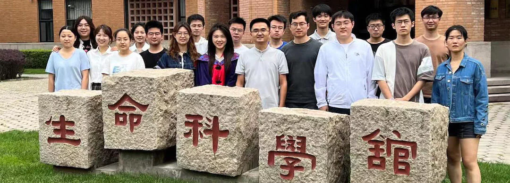
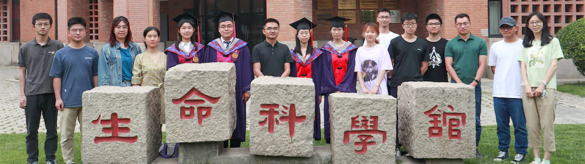
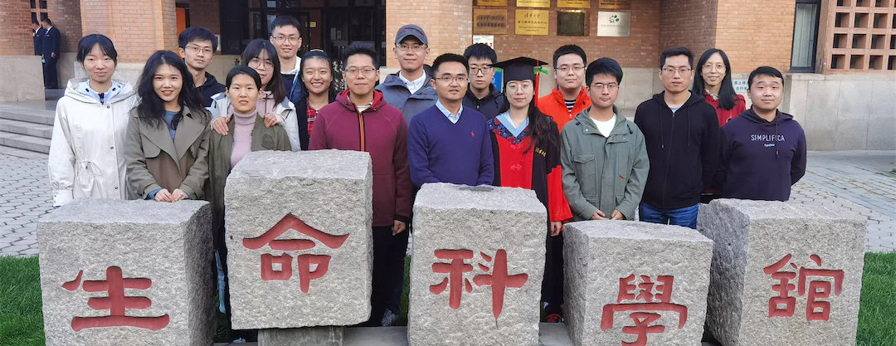
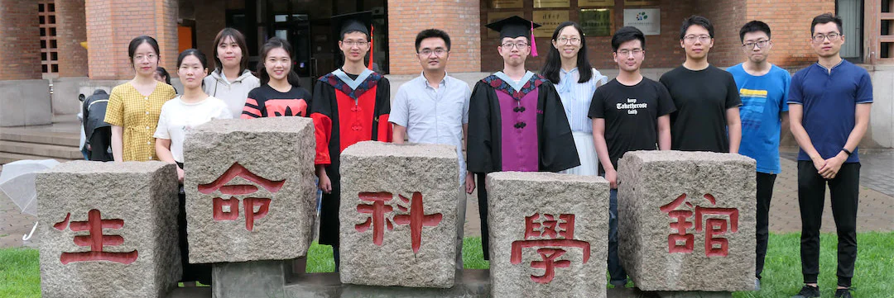
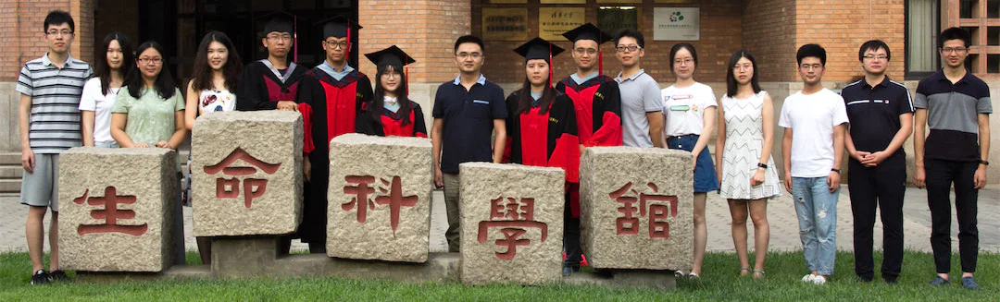
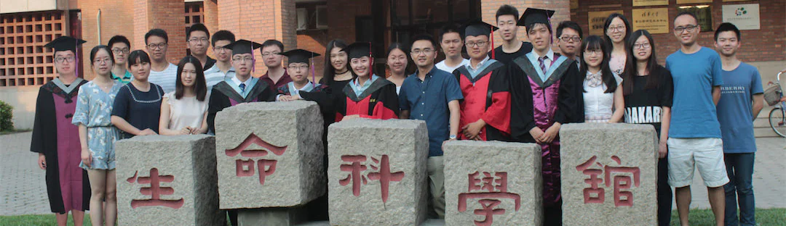
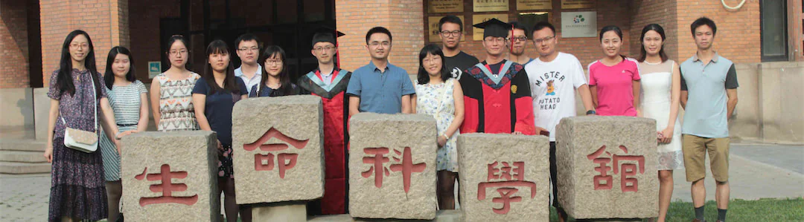

## 2022 

## 2021

## 2020

## 2019

## 2018

## 2017

## 2016

---

* [Academic Tree](../academic.md)
* [Alumni](https://cloud.tsinghua.edu.cn/f/146aaa65df0641ff9fd4/)
* [Event Photos](https://cloud.tsinghua.edu.cn/d/97e8ead7974a461499d3/?p=%2F&mode=grid)

