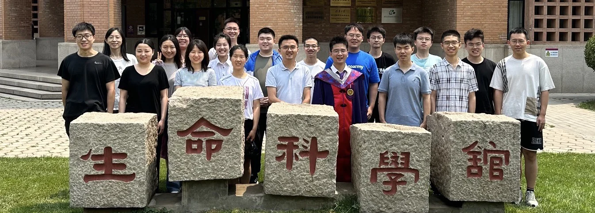

   
“少年应有鸿鹄志，当骑骏马踏平川 ” 
  -《史记·陈涉世》

"What sculpture is to a block of marble, education is to a human soul." - Joseph Addison
“The carving and chipping away to create a masterpiece **take years of dedication**. 
Teachers help students **discover their interests, passions, and ultimately themselves**.”

---

* [Lab Members & Alumni](https://cloud.tsinghua.edu.cn/f/146aaa65df0641ff9fd4/)
* [Event Photos](https://cloud.tsinghua.edu.cn/d/97e8ead7974a461499d3/?p=%2F&mode=grid)
* [Academic Tree](../academic.md)

