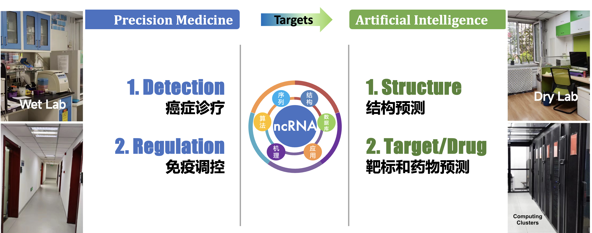
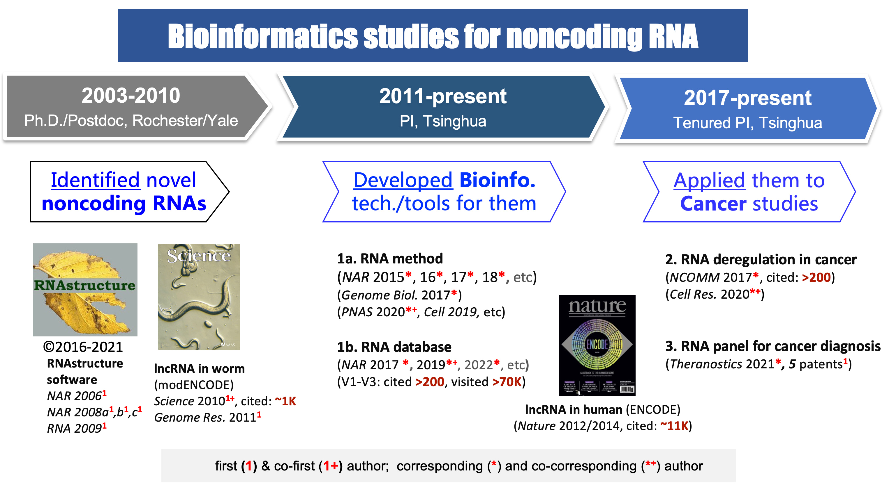

**Table of Contents:**

> We have two major research projects/directions in our lab.

* TOC
{:toc}

---

_Our group is interested in developing <b>bioinformatics technologies</b>, and practicing evidence-based <b>precision medicine</b> for diseases like cancer._ We utilize high-throughput sequencing technologies for **multi-omics**, together with **machine learning and AI**, to understand how genetic information is encoded in the structured DNA and RNA sequences, and how they interact and regulate each other in a biological system, including both animal and plant. Ultimately, this will help us understand and cure human diseases, know and improve ourselves.

 
我们实验室致力于发展**生物信息学技术**，并探索其在癌症等复杂疾病的**精准医疗**上的具体实践。我们利用机器学习等**人工智能技术**，结合**多组学**数据，来研究遗传信息是如何被编码在结构化的DNA和RNA分子之中，以及它们是如何在一个生命体系中相互作用、彼此调控。
“上工治未病”，我们的一个重要使命，是帮助人们更早期的发现癌症。我们相信，这种使命感以及为此付出的实践和努力，将帮助我们理解和治疗人类疾病，并最终认识和提高我们自己。

**我们针对noncoding RNA的近20年的研究经验**和主要成果如下图所示 (see details in [Publications](../publications))：

## 代表性在研项目

* 国家自然科学基金 面上项目，3217040246，体液多组学数据整合的生物信息学研究及其在癌症无创检测上的应用，2022-2025		主持
* 国家自然科学基金 面上项目，81972798，针对癌症诊断和预后的新型体液exRNA标志物的研究，2020-2023		主持
* 国家“凤凰工程”  技术创新开放共享课题，2021-NCPSB-005，多组学整合的生物信息学研究，2021/07-2023/06	主持
* 北京市高精尖结构生物学中心 竞争性项目， 翻译调控中的 RNA结构研究，2020/07-2023/06	主持
* 清华大学国强研究院  人工智能与机器人项目，2021GQG1020，生物调控网络知识启发下的新型AI模型的构建及其在癌症早诊上的应用，2022/04-2024/03	主持
* 清华大学春风基金，2021Z99CFY022，针对微生物感染的新型核酸检测技术研发，2021/09-2023/09	主持

## 1. Precision Medicine {#MED}

**利用基因组学和生物信息学技术，重点开展exRNA/cfRNA在精准医疗尤其是癌症早筛和个性化的免疫治疗上的研究和应用**。**exRNA** (extra-cellular RNA) 在很多临床研究尤其是液体活检研究中又称为 **cfRNA** (cell free RNA) ，包括了很多非编码 RNA（如 miRNA，lncRNA）。近年来，各种各样的RNA类型，尤其是各种非编码RNA（noncoding RNA, ncRNA），在很多重要的生命活动中被发现并引起人们的关注。研究表明，RNA可通过不同途径参与多种生命活动，与人类疾病密切相关，比如癌症。我们将和医学院、药学院的其他实验室紧密合作，做好学科交叉，利用好我们在方法、理论和机制方面的研究成果，充分发挥我们在疾病基因组学和RNA数据挖掘分析方面的经验、方法优势和理论基础。我们之前在肝癌上的研究成果表明非编码RNA在癌症的发生发展和迁移中起到了重要的作用，我们将继续这一研究，注重在肿瘤实体以及体液检测中的新型分子标志物方面的应用性研究。

_**exRNA/cfRNA in Cancer**_: In clinical studies like liquid biopsy, exRNA (extra-cellular RNA) is also called cfRNA(cell free RNA). Many exRNAs are noncoding RNAs, like miRNAs and long noncoding RNAs (lncRNAs). 

## 2. Machine Learning & AI {#AI}

### 2.1 Omics Model

**和Omics相关的生物信息学基础理论和方法的研究，尤其是最新的机器学习技术的应用。** 基础的理论和方法是应用的基础，我们针对新一代高通量数据的机器学习模型，深入研究针对RNA尤其是非编码RNA的生物信息学理论、算法和方法。不同领域的新方法和新思维的引入，往往能带来本学科的突破性进展，所以我们将尤其注意将最新的计算领域的新技术和新思维（例如“深度学习”中的新方法）引入到生物数据的研究上。

### 2.2 RNA Model

利用生物信息学方法在**RNA结构和调控**等基础科学问题上的探索。RNA在被转录后，会有着非常复杂而精细的调控，例如加工剪切，修饰，细胞定位，编辑，加尾，降解等等。而这些又和RNA自身的结构以及识别RNA序列和结构的蛋白息息相关。我们将利用我们关于RNA结构及其靶标蛋白方面的在理论和方法上的研究成果，研究生物当中RNA的转录后调控机制。同时，我们开发RNA结构预测算法，深入研究针对RNA尤其是非编码RNA的生物信息学理论、算法和方法。

