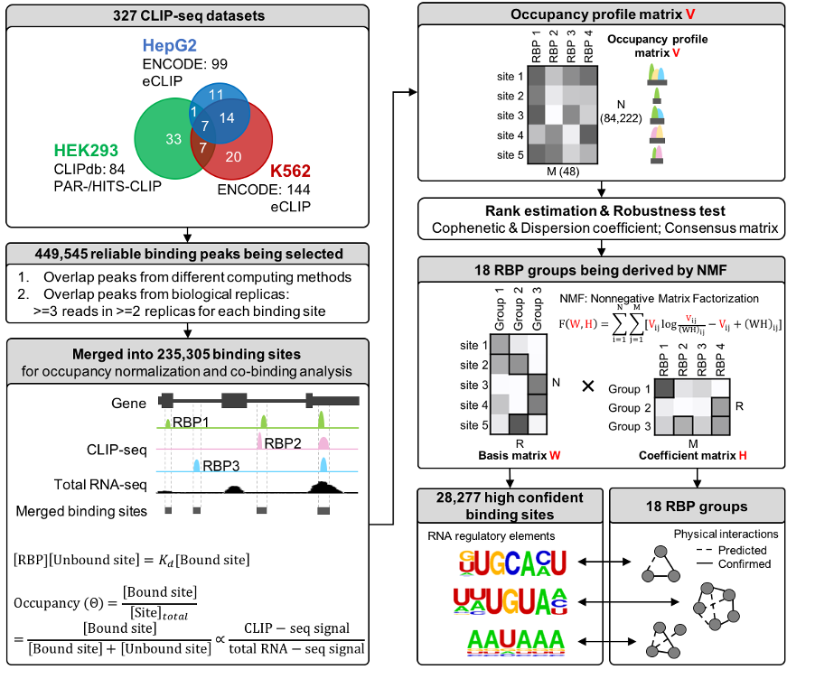
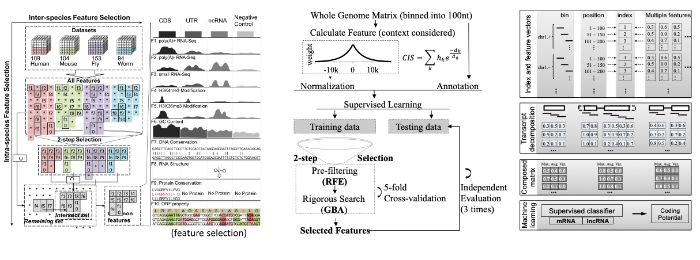

**Table of Contents:**

> We have three major research projects/directions in our lab.

* TOC
{:toc}

---

_Our group is interested in developing bioinformatics technologies and practicing evidence-based medicine._ We utilize high-throughput sequencing technologies, together with machine learning and AI, to understand how genetic information is encoded in the structured DNA and RNA sequences, and how they interact and regulate each other in a biological system. Ultimately, this will help us understand and cure human diseases, know and improve ourselves.

“我们的使命是要帮助人们更早期地发现癌症的发生，因为上工治未病。”
 
我们实验室致力于发展生物信息学技术，并探索能够广泛应用于基因组学和癌症生物学的医学实践。我们利用高通量测序，结合机器学习和人工智能技术，来研究遗传信息是如何被编码在结构化的DNA和RNA分子之中，以及它们是如何在一个生命体系中相互作用、彼此调控。我们相信，这种使命感以及为此付出的实践和努力，将帮助我们理解和治疗人类疾病，并最终认识和提高我们自己。

> 清华大学鲁志实验室一直致力于和RNA相关的生物信息学研究，从非编码RNA的“序列-结构-功能（靶标）”三个层次研发了一套系统性的生物信息学方法；这套方法得到了很好的认可，被合作者应用和共同发表在多个物种的RNA研究中（Science1 2010; Nature 2012; Nature Biotech. 2012; Nature 2014; Cell Stem Cell 2016; Cell 2019; PNAS 2020\*）。尤其是和医学专家合作，发表了和癌症发生迁移相关的新型非编码RNA和表观遗传调控机制，可以用来做癌症诊断和预后辅助的分子标志物（Nature Commun. 2017\*, Clinical Chem. 2019\*, Cell Res. 2020\*）。鲁志博士一共发表重要期刊文章近60篇, 总引用超过 10000 次。其中近5年发表文章30余篇，包括通讯作者文章21篇（影响因子10分以上的11篇）。申请人的学术成绩多年来得到了一贯的认可，获得了“长江学者”青年项目（2019）,“霍英东”青年基金（2018）,国家“优秀青年”基金（2016）等；同时，2014年起担任“生物信息学”教育部重点实验室（~50个实验室联合组成）副主任。

---

## [1. RNA Regulation] Post-transcriptional Regulation {#RNA}

**利用生物信息学方法在RNA转录后调控这一基本科学问题上的探索：** RNA在被转录后，会有着非常复杂而精细的调控，例如加工剪切，修饰，细胞定位，编辑，加尾，降解等等。而这些又和RNA自身的结构以及识别RNA序列和结构的蛋白息息相关。我们将和生命学院植物学中心的其他实验室紧密合作，做好学科交叉，利用我们关于RNA结构及其靶标蛋白方面的在理论和方法上的研究成果，研究生物当中RNA的转录后调控机制。

Post-transcriptional regulation of RNAs is critical to the diverse range of cellular processes. The volume of functional genomic data focusing on post-transcriptional regulation logics continues to grow in recent years. In [POSTAR](http://lulab.life.tsinghua.edu.cn/postar), we included the following new features and data: updated ∼500 CLIP-seq datasets (∼1200 CLIP-seq datasets in total) from six species, including human, mouse, fly, worm, Arabidopsis and yeast; added a new module ‘Translatome’, which is derived from Ribo-seq datasets and contains ∼36 million open reading frames (ORFs) in the genomes from the six species; updated and unified post-transcriptional regulation and variation data. Finally, we improved web interfaces for searching and visualizing protein– RNA interactions with multi-layer information. Meanwhile, we also merged our CLIPdb database into POSTAR2. POSTAR2 will help researchers investigate the post-transcriptional regulatory logics coordinated by RNA-binding proteins and translational landscape of cellular RNAs.

Crosslinking immunoprecipitation sequencing (CLIP-seq) technologies have enabled researchers to characterize transcriptome-wide binding sites of RNA-binding protein (RBP) with high resolution. We apply a soft-clustering method, RBPgroup, to various CLIP-seq datasets to group together RBPs that specifically bind the same RNA sites. Such combinatorial clustering of RBPs helps interpret CLIP-seq data and suggests functional RNA regulatory elements. Furthermore, we validate two RBP–RBP interactions in cell lines. Our approach links proteins and RNA motifs known to possess similar biochemical and cellular properties and can, when used in conjunction with additional experimental data, identify high-confidence RBP groups and their associated RNA regulatory elements.

> **代表性工作**
>
> 实验室在《Genome Biology》发表题为Identification of high-confidence RNA regulatory elements by combinatorial classification of RNA–protein binding sites的方法学论文，该论文通过整合RNA及其结合蛋白（RBP）相互作用的高通量测序数据（CLIP-seq），开发了一个基于非负矩阵分解（NMF）的生物信息学方法 -- RBPgroup。该方法不但能鉴定出具有高可信度的RNA调控元件，与此同时，也能够预测多个RNA结合蛋白（RBP）之间的潜在相互作用关系。该成果为研究多个蛋白在RNA上的协同调控提供了有力的新方法。
>
> RNA结合蛋白（RBP）对于细胞维持如RNA剪接，RNA聚腺苷酸化，RNA转运，翻译和转录本降解等一系列基本的细胞学功能至关重要。基于一项研究工作的估计，人类存在超过1500种不同的RBP，这些RBP通过结合不同的RNA靶标序列（调控元件），进而行使其相应的生物学功能。许多RNA结合蛋白在结合其RNA靶标时存在相互作用或竞争的关系，因此，研究RNA结合蛋白的组合方式和鉴定相应的RNA调控原件，对研究各种后转录调控机制至关重要。
>
> 近几年来，紫外交联免疫沉淀结合高通量测序（CLIP-seq）技术的出现，使得研究人员能够在不同哺乳动物细胞中鉴定转录组范围内的、具有高分辨率的RNA-RNA结合蛋白的结合位点。目前，为了揭示重要的后转录调控机制，越来越多的CLIP-seq数据被产出，这些RNA结合蛋白的结合位点已经在我们实验室的前期工作中被很好地整理和收录在诸如CLIPdb和POSTAR等重要的数据库中。在这些大数据的基础上，整合多个CLIP-seq数据，研究RNA和多个结合蛋白的相互协同作用，对研究复杂的RNA转录后调控网络非常关键。
>
> 我们利用从文献中收集的HEK293，HepG2和K562三个细胞系的327套CLIP-seq数据，通过整合分析，发展了基于非负矩阵因子分解（NMF）的生物信息学方法 -- RBPgroup。该工作表明，相同聚类组中的RNA结合蛋白在功能上存在重要的相关性，与此同时，在该组对应的RNA靶标序列中，能够显著富集出与RNA重要调控作用相关的调控元件。该研究将这套研究方法体系应用于国际ENCODE（Encyclopedia of DNA Elements）计划中的eCLIP数据，发现了众多潜在的RNA结合蛋白的调控复合物（或竞争物）组合，并且其中部分得到了实验的验证。为了让科学界更容易获得这项工作的研究结果，对应生物信息学工具RBPgroup的代码被公开在开源网站 [RBPgroup@GitHub](https://github.com/lulab/RBPgroup)。
>
> 

## [2. RNA Biomarker] Precision Medicine {#MED}

**RNA生物信息学在癌症和精准医疗上的应用：**
近年来，各种各样的RNA类型，尤其是各种非编码RNA（noncoding RNA, ncRNA），在很多重要的生命活动中被发现并引起人们的关注。研究表明，RNA可通过不同途径参与多种生命活动，与人类疾病密切相关，比如癌症。我们将和医学院、药学院的其他实验室紧密合作，做好学科交叉，利用好我们在方法、理论和机制方面的研究成果，充分发挥我们在疾病基因组学和RNA数据挖掘分析方面的经验、方法优势和理论基础。我们之前在肝癌上的研究成果表明非编码RNA在癌症的发生发展和迁移中起到了重要的作用，我们将继续这一研究，注重在肿瘤实体以及体液检测中的新型分子标志物方面的应用性研究。

Long noncoding RNAs (lncRNAs) have been associated with cancer (such as Hepatocellular carcinoma, HCC), but a comprehensive analysis of their specific association with HCC metastasis has not been conducted. Here, by analysing 60 clinical samples’ RNA-seq data from 20 HCC patients, we have identified and characterized 8,603 candidate lncRNAs. The expression patterns of 917 recurrently deregulated lncRNAs are correlated with clinical data in a TCGA cohort and published liver cancer data. Matched array data from the 60 samples show that copy number variations (CNVs) and alterations in DNA methylation contribute to the observed recurrent deregulation of 235 lncRNAs. Many recurrently deregulated lncRNAs are enriched in co-expressed clusters of genes related to cell adhesion, immune response and metabolic processes. Candidate lncRNAs related to metastasis, such as HAND2-AS1, were further validated using RNAi-based loss-of-function assays. Thus, we provide a valuable resource of functional lncRNAs and biomarkers associated with HCC tumorigenesis and metastasis.

> **代表性工作**
>
> 清华大学生命科学学院鲁志课题组、信息学院与医学院张奇伟课题组以及上海东方肝胆医院王红阳院士课题组在《Nature Communications》合作发表题为Recurrently deregulated lncRNAs in hepatocellular carcinoma的研究论文，该论文通过基因组学和生物信息学方法揭示了在肝癌发生发展及转移过程中发挥调控作用的多个新型长链非编码RNA基因（lncRNA），发现了可以作为肝癌诊断和预后的新型RNA分子标志物。
>
> 肝癌（Hepatocellular carcinoma, HCC）是常见的恶性肿瘤之一，恶性程度极高，侵袭能力强，易转移，预后较差，严重危害着人类的健康。肝癌发生的确切分子机制尚不完全清楚，可以由多种因素引起。肝癌细胞极易侵袭进入门静脉系统，并在门静脉中形成癌栓，肝癌门静脉癌栓的形成是影响肝癌预后的重要因素。肝癌起病隐匿，早期缺乏明显的临床症状，因此研究和发现高效的肝癌相关生物标志物有助于治疗肝癌，提高疗效，改善预后。
>
> 长链非编码RNA（long noncoding RNA, lncRNA）是一类长度大于200个碱基，但没有长开放阅读框和蛋白编码功能的RNA。近年来，各种各样的lncRNA在很多重要的生命活动中被发现并引起人们的关注。研究表明，lncRNA可通过不同途径参与多种生命活动，与人类疾病密切相关，比如癌症。
>
> 为了发现和研究在肝癌发生和转移中发挥调控作用的lncRNA及相关分子标志物，该项工作首先对20组肝癌临床样本（包括癌组织，癌旁组织，癌栓组织）进行了高通量测序。之后，利用相关课题组在过去几年来开发的一系列针对非编码RNA的最新生物信息学算法和方法，鉴定出了近千条与肝癌发生发展相关的lncRNA，其中有上百条与肝癌的转移相关。进一步地，该项工作还对这些临床样本进行了DNA拷贝数差异（CNV）分析和DNA甲基化水平分析，鉴定了这些lncRNA的可能调控机理。并且，通过构建lncRNA与蛋白表达基因的双色共表达调控网络，该项工作也预测了lncRNA的生物学功能及可能参与的信号通路。最后，通过基于RNA干扰试验，7条影响肝癌细胞迁移的lncRNA也得到了很好的功能性验证。该项工作的一个非常重要的结果，是利用中国临床样本，结合国际TCGA项目的大规模临床样本数据，发现了在多个肝癌病人及其转移癌栓中重复性异常表达的新型非编码RNA基因，并进一步预测了可以作为肝癌诊断和预后的新型RNA标志物，具有很好的临床应用前景。
>
> 

## [3. RNA Bioinformatics] Machine Learning & AI {#AI}

**和RNA相关的生物信息学基础理论和方法的研究：** 基础的理论和方法是应用的基础，我们将基于过去开发的RNA二级结构预测算法和针对新一代高通量数据的机器学习模型,继续深入研究针对RNA尤其是非编码RNA的生物信息学理论、算法和方法。同时，我们将和信息学院的其他实验室紧密合作，做好学科交叉。不同领域的新方法和新思维的引入，往往能带来本学科的突破性进展，所以我们将尤其注意将最新的计算领域的新技术和新思维（例如“深度学习”中的新方法）引入到生物数据的研究上。

Recent genomic studies suggest that novel long non-coding RNAs (lncRNAs) are specifically expressed and far outnumber annotated lncRNA sequences. To identify and characterize novel lncRNAs in RNA sequencing data from new samples, we have developed COME, a coding potential calculation tool based on machine learning with multiple features. It integrates multiple sequence-derived and experiment-based features using a decompose–compose method, which makes it more accurate and robust than other well-known tools. We also showed that COME was able to substantially improve the consistency of predication results from other coding potential calculators. Moreover, COME annotates and characterizes each predicted lncRNA transcript with multiple lines of supporting evidence, which are not provided by other tools. Remarkably, we found one subgroup of lncRNAs classified by such supporting features, i.e., conserved local RNA secondary structure. Overall, we present COME as an accurate, robust and multiple-feature supported machine learning method for the identification and characterization of novel lncRNAs.

> **代表性工作**
>
> 实验室一直致力于和RNA相关的生物信息学研究，从非编码RNA的“序列-结构-功能（靶标）”三个层次研发了一套系统性的生物信息学方法 (ncRNA Project)。这些方法和 [软件](http://www.ncrnalab.org/software) 分为3个层次和系列：
>
> (1) **RNAfinder**软件系列: 利用机器学习发现基因组暗物质-新型非编码RNA基因
>
> 由实验室ncRNA Project开发的第一个软件系列RNAfinder发表了两个新的成果：RNAfeature和COME。非编码RNA(noncoding RNA)是一类新型基因，它们在生物体内行使着多种多样的重要功能。为了能够有效地鉴定这些新基因，ncRNA project开发了两个配套的基于机器学习方法的工具：RNAfeature 和COME。RNAfeature通过机器学习方法整合并筛选了超过600套基因组学数据、表观基因组学数据、转录组学数据与多个进化学、生物物理学数值特征，得到了包括序列特征、结构特征、表达谱特征及表观遗传标记特征等10个共有特征可以跨物种跨种类描述非编码RNA。进一步地， COME可以将这些特征整合在一起并非常有效地鉴定新型非编码RNA。RNAfeature和 COME各自发表于生物信息学代表性期刊Nucleic Acids Research上（2015和2016），被很多重要的基因组学工作采用，其中最具影响力的是国际重大研究计划ENCODE（人类基因组注释计划）。
>
> (2) **RNAstructurome**软件系列: 利用能量模型和高通量测序预测RNA二级结构
>
> 由实验室ncRNA Project开发的第二个软件系列RNAstructurome最近发表了一个新的算法RME，并配套了一个网络服务RNAex。在中心法则中，RNA位于承上启下的位置。除了传递遗传信息，RNA还可以发挥结构介导的基因调控功能。但是，RNA结构目前还难以被准确解析。近年来，研究者们发明了一系列新的高通量结构测定技术，用于辅助RNA二级结构预测，是RNA功能生物学中非常耀眼的突破。为有效利用这些新型数据，我们首先开发了RME算法，实现了数据指导下的RNA二级结构预测，进而，我们搭建了RNAex在线服务器，提供了自动化的数据访问和软件使用。
RME算法基于统一的统计模型对高通量结构测定数据进行转换，而后将其加入到能量模型中，实现了整合两种信息的RNA二级结构预测。在数据区分度较好时，RME可以大幅提高RNA二级结构预测准确度。
RNAex服务器对目前主流的结构测定数据进行了统一处理，提供了4种模式物种的数据查询，和3种结构预测软件的在线使用，并将预测结构与功能信息进行统一可视化，使得用户可以快速有效的利用新型数据。
目前，RME算法和RNAex服务器各自发表于生物信息学代表性期刊Nucleic Acids Research上（2015和2016）。并被OMICtools数据库收录，是RNA结构组学目录下的第一个代表性算法。
>
> (3) **RNAtarget**软件系列: 建立RNA数据库，构建RNA和蛋白质的互作调控网络
>
>由清华大学鲁志实验室ncRNA Project 开发的第三个软件系列RNAtarget最近增添了2个新的工具：POSTAR和CLIPdb。在真核细胞内，转录组与转录后调控有着密切的关联：转录本RNA从产生直至降解的过程中，总是被RNA结合蛋白（RBP）和其他RNA分子结合，这些调控因子参与几乎所有的转录后调控事件，包括RNA分子的剪接、加尾、亚细胞定位以及降解等。近年来，已经在包括癌症和神经退行性疾病等多种严重的人类疾病中发现了RBP及其参与的转录后调控的异常。然而，目前关于RBP参与转录后调控的数据库和计算工具还相当有限。因此，我们以大规模的CLIP-seq数据集为基础，整合其他高通量数据，构建了RBP转录后调控的整合型数据库CLIPdb和CLIP2-POSTAR。CLIPdb 是提供全转录组水平上高精度的RBP结合位点的数据库。我们收集了来自四个物种（人类、小鼠、线虫与酵母）中400余套已发表的CLIP-seq数据集，涵盖了约120个RBP，使用统一的的计算方法在全转录组内鉴定RBP结合位点，并提供了方便的可视化和检索界面。CLIPdb的第2版，POSTAR 提供了人类和小鼠转录组中目前已知最全面的来自实验证据和计算预测的RBP结合位点，涵盖了236个RBP。更进一步，利用大量的分子调控事件、基因组变异位点以及功能性基因等信息，POSTAR对RBP结合位点进行了详细的功能注释，为进一步深入研究RBP调控机制提供了重要的参考信息。POSTAR和CLIPdb数据库已经发表于生物信息学权威期刊Nucleic Acids Research (2016) 和BMC Genomics (2015)和杂志，并且被Omic Tools工具库列为研究RBP调控功能的重要数据库之一。
>
> 
