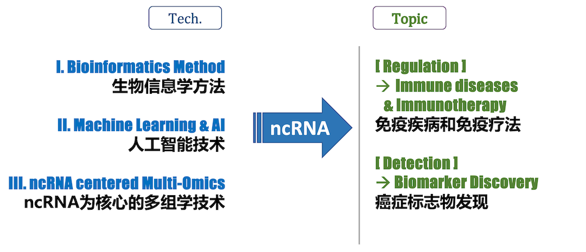

人类有大约2万个蛋白编码基因，但其序列的总长度仅占人类基因组总长度的1.5%左右。另一方面，人类基因组序列的~70%甚至更多都会被转录成RNA，这些很多都是非编码RNA，noncoding RNA (ncRNA)。

About 20 thousand protein-coding genes in human were transcribed and tranlsated from only ~1.5% of human genome sequence. On the other hand, ~70% or more of the human genome  are transcribed into RNAs. Many of them are noncoding RNAs (ncRNAs).

针对非编码RNA （**noncoding RNA, ncRNA)**），我们致力于两个主要研究方向：

We have two major research directions centered on **noncoding RNA (ncRNA)**:

* TOC
{:toc}

[Detailed Introduction](https://cloud.tsinghua.edu.cn/f/b77381dca00844a4890c/)

---

## I. Precision Medicine {#med}

We develop sequencing and bioinformatics methods to study extracellular transcriptome, noncoding RNA (ncRNA) in particular. By integrating transcriptomics data with other multiomics data, we aim to explain development of complex diseases (e.g., cancer, immune related diseases) based on an integrative, multi-dimensional level. For instance, we first collect published data as a multi-omics database, and then we will explore deep learning, transfer learning, similarity network fusion and other bioinformatics analysis techniques for these paired and unpaired multi-omics data. Subsequently, we will sequence multi-omics data in cancer plasma samples using the latest sequencing technology; and develop multi-modal models. 

The application of these methods to precision medicine can be mainly divided into two research directions: **Detection** and **Regulation**, including cancer screening and research on microenvironments such as immunity and cancer microorganisms.

我们探索新的高通量测序和生物信息学方法，研究和分析细胞外的转录组 (尤其是 noncoding RNA)。通过结合转录组和其他多组学数据，我们将从一个系统性的多分子层面揭示复杂疾病（如癌症, 免疫相关疾病）的发生发展规律。例如，我们首先收集发表数据构建体液多组学数据库，接着我们将基于这个数据库针对多模态数据探索深度学习、迁移学习、相似网络融合等生物信息分析技术，构建多模态模型。

这些方法的应用在精准医疗上可以主要分为**Detection**和**Regulation**两个研究方向，包括了癌症筛查、免疫调控、人体微生物调控等。

 
<small>We apply noncoding RNA (ncRNA) focused genomics and bioinformatics technologies to precision medicine, e.g., cancer microbiome, cancer screen and immunotherapy.</small>

### 1. RNA Detection

***cfRNA-seq Development.*** The cfRNA content in clinical plasma samples is very low and fragmented. Therefore, it is necessary to solve the problems of low signal-to-noise ratio and high cost of sequencing data. We apply technologies such as TSO, early barcoding, UMI, and CRISPR-Cas9 to develop novel cfRNA-seq technologies that reduce the cost of high-throughput sequencing, and improve the signal-to-noise ratio of sequencing data.

***Bioinfo. Method Development.*** For multi-dimensional and multi-modal data, such as cfRNA-seq data, we need 4 steps for machine learning and other analysis, including 1) Data Cleaning, 2) Feature extraction and engineering, 3) Model Fitting, 4) Classifier. We develop corresponding bioinformatics method, software, database and other tools for these four steps (see more in [Software](https://www.ncrnalab.org/software/)).

> **cfRNA/exRNA**: In clinical studies like liquid biopsy, exRNA (extra-cellular RNA) is also called cfRNA (cell free RNA). Many exRNAs are noncoding RNAs, like miRNA, lncRNA, srpRNA, circRN, etc. 

***cfRNA-seq Development***: 临床血浆样本中的 cfRNA 含量很低且碎片化，需要解决测序数据信噪比低、成本昂贵等问题。我们应用模板转换、早期标记、分子标签和CRISPR-Cas9等技术，开发新型 cfRNA-seq 技术，降低构建高通量测序文库的经济成本并提高了测序数据的信噪比。

***Bioinfo. Method Development:*** 对于多维度、多模态的高通量数据，例如 cfRNA-seq data，我们需要进行4个步骤来进行机器学习等分析，包括 1) Data Cleaning, 2) Feature extraction and engineering, 3) Model Fitting, 4) Classifier。我们针对这4个步骤开发相应的生物信息学方法、软件、数据库等工具（详见： [Software](https://www.ncrnalab.org/software/)）。

> **exRNA** (extra-cellular RNA) 在很多临床研究尤其是液体活检研究中又称为 **cfRNA** (cell free RNA) ，包括了很多非编码 RNA（如 miRNA，lncRNA，srpRNA，circRNA等）。

 
<small>Different NGS (next-generation sequencing) libraries of cfRNAs</small>

### 2. RNA Regulation

RNAs are dynamicly regulated during transcription. In addition, after RNA is transcribed, it will also have very complex and fine post-transcriptional regulation, such as alternative splicing (AS), alternative polyadenylation (APA), degradation, editing, modification, cellular localization and so on. These are closely related to the structure of RNA itself and the proteins that recognize RNA sequence and structure. These multiple regulation events (e.g., expression, splicing, editing, fusion) can be quantified by bioinformatic analysis from RNA-seq data. Subsequently, we will integrate these multi-modal data using deep learning models, for example Transformer, Adversarial autoencoder (AAE), and Deep adversarial variational autoencoder model.

At the same time, RNAs, especially noncoding RNAs, also regulates other macromolecules, thus playing an important role in innate immune response and cancer immunity. We will explore these complex regulatory processes in complex diseases such as cancer and autoimmunity.

RNA不仅在转录时被动态调控，而且在被转录后也会有着非常复杂而精细的调控工程，例如剪接，修饰，细胞定位，编辑，加尾，降解等等。而这些又和RNA自身的结构以及识别RNA序列和结构的蛋白息息相关。因为RNA调控的丰富性，我们可以由RNA-seq数据通过生物信息分析计算得到多模态矩阵（例如表达、剪接、编辑、融合等），接着，我们将探索转换器（Transformer）、对抗自编码器（Adversarial autoencoder, AAE）、深度对抗变分自动编码器模型（Deep adversarial variational autoencoder model）等深度学习模型进行多模态数据的整合。

同时，RNA，尤其是noncoding RNA，还会调控其他大分子，从而在先天免疫应答、癌症免疫中起到重要的作用。我们将在癌症和自身免疫等复杂性疾病中探索这些复杂的调控过程。

## II. AI-driven Drug Design {#AI}

The introduction of new methods and new thinking in different fields can often lead to breakthrough progress in this discipline, so we pay special attention to introducing new technologies and new thinking in the latest computing field (such as new methods in deep learning) into biological data. We use bioinformatics methods to explore basic scientific questions such as the structure, regulation and target of RNAs (especially non-coding RNAs). Finally, it will bring us the new era of drug design.

不同领域的新方法和新思维的引入，往往能带来本学科的突破性进展，所以我们尤其注意将最新的计算领域的新技术和新思维（例如深度学习中的新方法）引入到生物数据的研究上，利用生物信息学和最新的 AI方法在RNA（尤其是非编码RNA）结构、调控和靶标等科学问题上进行探索。最终，这些将带领我们进入一个崭新思维的药物设计新时代。

### 1. RNA Structure

***RNA Structure.***  We develop structure prediction algorithm for RNA. The accurate prediction of RNA structure will help us better design drugs.

***RNA Structure:*** 我们开发针对 RNA 的结构预测算法，对 RNA 结构的准确预测，将帮助我们更好地设计药物。

### 2. RNA Target

***RNA Target and Drug Design.*** The number of human proteins that can be used as small-molecule drug targets is very limited：Of the ~20 thousand protein-coding genes in human (~1.5% of human genome sequence),  about 10%-15% are directly related to diseases; among these genes, it is estimated that less than 700 protein products are druggable (only ~0.05% of human genome sequence). On the other hand, ~70% or more of the human genome  are transcribed into RNAs. In recent years, more and more researchers have tried to use RNA as a drug target, and initially proved the feasibility of this strategy. In particular, it is worth noting that Coronavirus (COVID-19) is an RNA virus, and its genome itself is also promising as a drug target. Due to the high complexity and variability of RNA structure and the limitations of experimental methods, our current understanding of the three-dimensional structure of RNA is still very limited, and the development of RNA-targeting drugs is still in its infancy. We will use the latest artificial intelligence technologies such as deep learning to integrate various information, carry out functional RNA target prediction, and combine structure prediction and small molecule docking to achieve RNA target design, screening and verification.

可作为小分子药物靶标的人类蛋白数量非常有限：在人类的2万个左右的蛋白编码基因（占人类基因组总长度的1.5%左右）中，大约有 10%-15%与疾病直接相关；而在这些基因中，据估计仅有不到 700 个的蛋白产物是可以成药的 （仅占人类基因组总长度的 0.05%左右）。另一方面，人类基因组的~70%甚至更多都会被转录成 RNA。因此，近年开始有越来越多的研究者试图将 RNA 作为药物靶标，并初步证明了这一策略的可行性。尤其值得我们注意的是，新冠病毒就是 RNA 病毒，其基因组本身也有希望被作为药物靶标。由于 RNA 结构的高度复杂性和可变性，以及实验方法的限制，目前我们对于 RNA 的三维结构的了解仍非常有限，靶向 RNA 的药物研发也处在起步阶段。 我们将充分发挥人工智能的优势，利用深度学习等最新的计算技术整合 多方面的信息，进行功能性 RNA 靶标预测，结合结构预测和小分子对 接，实现 RNA 靶点的设计、筛选和验证。

  
   
  <small>The potential RNA-targeted druggable genome (Warner, et al., <i>Nature Reviews | Drug Discovery</i>  2018)</small>

## Funded Projects

* **Funding:**

  * 2022-2025     Bioinformatics study of body fluid multi-omics data integration for cancer diagnosis Novel, PI, National Natural Science Foundation of China

  * 2020-2023     Novel extracellular RNA biomarkers for cancer diagnosis and prognosis, PI, National Natural Science Foundation of China

  * 2021-2023     Development of bioinformatics technology for body fluid multi-omics data in cancer PI, National Center for Protein Sciences (Beijing)

  * 2020-2023     Post-transcriptional regulation and RNA structures, PI, Beijing Advanced Innovation Center for Structural Biology

  * 2022-2025     Multi-Omics study for personalized neoadjuvant therapy of HCC, PI, Tsinghua Precision Medicine Institute

  * 2022-2024     AI model informed by biological network for early cancer diagnosis, PI, Tsinghua Guoqiang AI Institute

  * 2021-2023     Development of nucleic acid detection technology for microbial infection, PI, Tsinghua Chunfeng Foundation

    

* **代表性在研项目:**
  * 国家自然科学基金 面上项目，3217040246，体液多组学数据整合的生物信息学研究及其在癌症无创检测上的应用，2022-2025		主持
  * 国家自然科学基金 面上项目，81972798，针对癌症诊断和预后的新型体液exRNA标志物的研究，2020-2023		主持
  * 国家“凤凰工程”  技术创新开放共享课题，2021-NCPSB-005，多组学整合的生物信息学研究，2021/07-2023/06	主持
  * 北京市高精尖结构生物学中心 竞争性项目， 翻译调控中的 RNA结构研究，2020/07-2023/06	主持
  * 清华大学精准医学研究院 精准医疗战略项目， 基于多组学数据的智能化中晚期肝癌转化治疗决策研究，2022/08-2025/07	主持
  * 清华大学国强研究院  人工智能与机器人项目，2021GQG1020，生物调控网络知识启发下的新型AI模型的构建及其在癌症早诊上的应用，2022/04-2024/03	主持
  * 清华大学春风基金，2021Z99CFY022，针对微生物感染的新型核酸检测技术研发，2021/09-2023/09	主持

