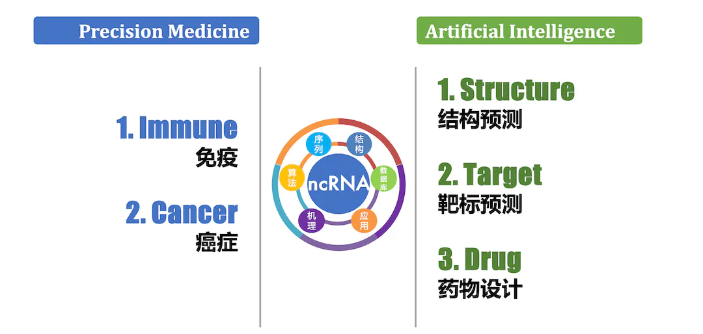

We have two major research directions.

* TOC
{:toc}

[Detailed Introduction](https://cloud.tsinghua.edu.cn/f/b77381dca00844a4890c/)

---

## A. Precision Medicine {#MED}

Early detection based on tumor biomarkers has very important clinical and social significance for cancer diagnosis and treatment, however, current biomarkers have poor generalization ability because of the inter-heterogeneity and intra-heterogeneity among individuals and tumor cells. 

癌症早期诊断具有非常重要的临床价值和社会意义，但由于癌症异质性高等原因，基于标志物的液体活检技术在实际的癌症检测中泛化能力较差、准确性也有待提高。

### A1 NGS Technology Development

***cfRNA-seq Development.*** The cfRNA content in clinical plasma samples is very low and fragmented. Therefore, it is necessary to solve the problems of low signal-to-noise ratio and high cost of sequencing data. We apply technologies such as TSO, early barcoding, UMI, and CRISPR-Cas9 to develop novel cfRNA-seq technologies that reduce the cost of high-throughput sequencing, and improve the signal-to-noise ratio of sequencing data.

> **cfRNA/exRNA**: In clinical studies like liquid biopsy, exRNA (extra-cellular RNA) is also called cfRNA (cell free RNA). Many exRNAs are noncoding RNAs, like miRNA, lncRNA, srpRNA, circRN, etc. 

***cfRNA-seq Development***: 临床血浆样本中的 cfRNA 含量很低且碎片化，需要解决测序数据信噪比低、成本昂贵等问题。我们应用模板转换、早期标记、分子标签和CRISPR-Cas9等技术，开发新型 cfRNA-seq 技术，降低构建高通量测序文库的经济成本并提高了测序数据的信噪比。

> **exRNA** (extra-cellular RNA) 在很多临床研究尤其是液体活检研究中又称为 **cfRNA** (cell free RNA) ，包括了很多非编码 RNA（如 miRNA，lncRNA，srpRNA，circRNA等）。

 
<small>Different NGS (next-generation sequencing) libraries of cfRNAs</small>

### A2 Multi-Omics Data Mining

Recently, people are increasingly aware of the importance of big omics data in realizing early cancer diagnosis, but how to implement it is still under exploration. This project intends to develop new bioinformatics methods to integrate multi-omics data (e.g., cfDNA methylation, cfRNA/exRNA and sEV protein，etc) of cancer, which aims to explain cancer development based on an integrative, multi-dimensional level. We will first collect published data as a multi-omics database, and then we will explore deep learning, transfer learning, similarity network fusion and other bioinformatics analysis techniques for these paired and unpaired multi-omics data. Subsequently, we will sequence multi-omics data in cancer plasma samples using the latest sequencing technology; and develop a multi-dimensional model as a multi-molecular markers for non-invasive cancer detection. 

近年来，人们逐渐认识到多组学大数据在实现癌症早期诊断中的重要性，但具体如何实现多维数据的有效整合以及优化出癌症体液标志物组合，还有待探索和研究。本项目拟探索新的生物信息学方法，分析和整合癌症病人血液中的cfDNA甲基化、exRNA/cfRNA和sEV（如外泌体）蛋白等体液多组学数据，从一个系统性的多分子层面揭示癌症发生发展规律。我们将首先收集发表数据构建体液多组学数据库，接着我们将基于这个数据库针对配对和不配对的多组学数据探索深度学习、迁移学习、相似网络融合等生物信息分析技术，构建多模态模型，开发用于癌症无创检测的多分子组合标志物。

 
<small>We apply cfRNA-focused genomics and bioinformatics technologies to precision medicine, e.g., early cancer screen, cancer immunology and cancer microbiome.</small>

## B. Machine Learning & AI {#AI}

### B1 Omics Model

Omics data, especially those from body fluid, are sparse and heterogenous. Therefore, we tend to develop a paired integration model based on techniques like deep learning with regard to these features. At first, we collect paired multi-omics data (multi-omics, which includes proteomics, transcriptomics, genomics and epigenomics data) or multi-features matrix calculated by bioinformatic analysis from a single omics data (multi-features, features like expression and splicing calculated from RNA-seq, for example). Then we explore the possibility of integrating body fluid multi-omics data or multi-features data by multiple deep learning models, for example Transformer, Adversarial autoencoder (AAE), and Deep adversarial variational autoencoder model, to find multi-omics integrated markers through the important neurons in the latent space, and to illustrate the gene composition, omics sources and relations by model visualization.

很多组学数据，尤其是体液中的组学数据，具有稀疏化、异质性明显等特点，我们将针对这些特点开发基于深度学习等技术的配对整合模型。首先我们收集配套的多组学数据（multi-omics，蛋白组学、转录组学、基因组学和表观组学数据）或者是由一个组学数据通过生物信息分析计算得到多特征矩阵（multi-features，例如，通过 RNA-seq 可以计算得到表达、剪接等多特征）。其次我们将探索转换器（Transformer）、对抗自编码器（Adversarial autoencoder, AAE）、深度对抗变分自动编码器模型（Deep adversarial variational autoencoder model）等深度学习模型进行体液多组学数据或者多特征数据的整合，通过潜在空间重要神经元找到多组学整合标记物，并通过模型可视化来解释多组学整合标记物的基因组成、组学来源和相关关系。

 
<small>Multi-Omics strategies for diagnosis and prognosis of cancer from liquid biopsy samples (Heitzer, et al., <i>Nature Reviews | Genetics</i>  2018)</small>

 

### B2 RNA Model

The introduction of new methods and new thinking in different fields can often lead to breakthrough progress in this discipline, so we pay special attention to introducing new technologies and new thinking in the latest computing field (such as new methods in deep learning) into biological data. We use bioinformatics methods to explore basic scientific questions such as the structure and regulation of RNAs (especially non-coding RNAs).

***RNA Regulation.*** After RNA is transcribed, it will have very complex and fine post-transcriptional regulation, such as alternative splicing (AS), alternative polyadenylation (APA), degradation, editing, modification, cellular localization and so on. These are closely related to the structure of RNA itself and the proteins that recognize RNA sequence and structure. We use our theoretical and methodological findings on RNA structure and its interacted proteins to study the mechanisms of post-transcriptional regulation of RNA.

***RNA Structure, Target and Drug Design.*** Meanwhile, we develop structure prediction algorithm for RNA. The accurate prediction of RNA structure will help us better design drugs. The number of human proteins that can be used as small-molecule drug targets is very limited：Of the ~20 thousand protein-coding genes in human (~1.5% of human genome sequence),  about 10%-15% are directly related to diseases; among these genes, it is estimated that less than 700 protein products are druggable (only ~0.05% of human genome sequence). On the other hand, ~70% or more of the human genome  are transcribed into RNAs. In recent years, more and more researchers have tried to use RNA as a drug target, and initially proved the feasibility of this strategy. In particular, it is worth noting that Coronavirus (COVID-19) is an RNA virus, and its genome itself is also promising as a drug target. Due to the high complexity and variability of RNA structure and the limitations of experimental methods, our current understanding of the three-dimensional structure of RNA is still very limited, and the development of RNA-targeting drugs is still in its infancy. We will use the latest artificial intelligence technologies such as deep learning to integrate various information, carry out functional RNA target prediction, and combine structure prediction and small molecule docking to achieve RNA target design, screening and verification.

不同领域的新方法和新思维的引入，往往能带来本学科的突破性进展，所以我们尤其注意将最新的计算领域的新技术和新思维（例如深度学习中的新方法）引入到生物数据的研究上，利用生物信息学方法在**RNA（尤其是非编码RNA）结构和调控**等基础科学问题上进行探索。

***RNA Regulation:*** RNA在被转录后，会有着非常复杂而精细的调控，例如加工剪切，修饰，细胞定位，编辑，加尾，降解等等。而这些又和RNA自身的结构以及识别RNA序列和结构的蛋白息息相关。我们利用我们关于RNA结构及其靶标蛋白方面的在理论和方法上的研究成果，研究生物当中RNA的转录后调控机制。

***RNA Structure, Target and Drug Design:*** 同时，我们开发针对 RNA 的结构预测算法，对 RNA 结构的准确预测，将帮助我们更好地设计药物。可作为小分子药物靶标的人类蛋白数量非常有限：在人类的2万个左右的蛋白编码基因（占人类基因组总长度的1.5%左右）中，大约有 10%-15%与疾病直接相关；而在这些基因中，据估计仅有不到 700 个的蛋白产物是可以成药的 （仅占人类基因组总长度的 0.05%左右）。另一方面，人类基因组的~70%甚至更多都会被转录成 RNA。因此，近年开始有越来越多的研究者试图将 RNA 作为药物靶标，并初步证明了这一策略的可行性。尤其值得我们注意的是，新冠病毒就是 RNA 病毒，其基因组本身也有希望被作为药物靶标。由于 RNA 结构的高度复杂性和可变性，以及实验方法的限制，目前我们对于 RNA 的三维结构的了解仍非常有限，靶向 RNA 的药物研发也处在起步阶段。 我们将充分发挥人工智能的优势，利用深度学习等最新的计算技术整合 多方面的信息，进行功能性 RNA 靶标预测，结合结构预测和小分子对 接，实现 RNA 靶点的设计、筛选和验证。

  
   
  <small>The potential RNA-targeted druggable genome (Warner, et al., <i>Nature Reviews | Drug Discovery</i>  2018)</small>

## Funded Projects

* **Funding:**

  * 2022-2025     Bioinformatics study of body fluid multi-omics data integration for cancer diagnosis Novel, PI, National Natural Science Foundation of China

  * 2020-2023     Novel extracellular RNA biomarkers for cancer diagnosis and prognosis, PI, National Natural Science Foundation of China

  * 2021-2023     Development of bioinformatics technology for body fluid multi-omics data in cancer PI, National Center for Protein Sciences (Beijing)

  * 2020-2023     Post-transcriptional regulation and RNA structures, PI, Beijing Advanced Innovation Center for Structural Biology

  * 2022-2025     Multi-Omics study for personalized neoadjuvant therapy of HCC, PI, Tsinghua Precision Medicine Institute

  * 2022-2024     AI model informed by biological network for early cancer diagnosis, PI, Tsinghua Guoqiang AI Institute

  * 2021-2023     Development of nucleic acid detection technology for microbial infection, PI, Tsinghua Chunfeng Foundation

    

* **代表性在研项目:**
  * 国家自然科学基金 面上项目，3217040246，体液多组学数据整合的生物信息学研究及其在癌症无创检测上的应用，2022-2025		主持
  * 国家自然科学基金 面上项目，81972798，针对癌症诊断和预后的新型体液exRNA标志物的研究，2020-2023		主持
  * 国家“凤凰工程”  技术创新开放共享课题，2021-NCPSB-005，多组学整合的生物信息学研究，2021/07-2023/06	主持
  * 北京市高精尖结构生物学中心 竞争性项目， 翻译调控中的 RNA结构研究，2020/07-2023/06	主持
  * 清华大学精准医学研究院 精准医疗战略项目， 基于多组学数据的智能化中晚期肝癌转化治疗决策研究，2022/08-2025/07	主持
  * 清华大学国强研究院  人工智能与机器人项目，2021GQG1020，生物调控网络知识启发下的新型AI模型的构建及其在癌症早诊上的应用，2022/04-2024/03	主持
  * 清华大学春风基金，2021Z99CFY022，针对微生物感染的新型核酸检测技术研发，2021/09-2023/09	主持
