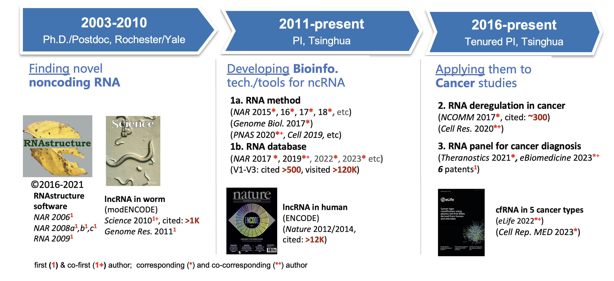

**Table of Contents:**

* TOC
{:toc}

[Full list of publications](./index.md)

---

## I. RNA-finder

- Yu-Xiang Chen1, Zhi-yu Xu1, Xueliang Ge, Suparna Sanyal, **Zhi John Lu\*** and Babak Javid* (2020) Selective translation by alternative bacterial ribosomes. **PNAS** 117(32):19487-19496 (1contributed equally, *co-corresponding authors) (IF: 12.78)
- \[**Algorithm V3**\] Zhiyu Xu1, Long Hu1, Binbin Shi, SiSi Geng, Longchen Xu, Dong Wang* & **Zhi John Lu\*** (2018) Ribosome elongating footprints denoised by wavelet transform comprehensively characterize dynamic cellular translation events. **Nucleic Acids Research** 46 (18), e109-e109 (IF: 19.16) Github: https://github.com/lulab/Ribowave
- Yang Yang1, Lei Chen1, Jin Gu1, Hanshuo Zhang1, …, Hongyang Wang*, Michael Q. Zhang* and **Zhi John Lu\*** (2017) Recurrently deregulated lncRNAs in hepatocellular carcinoma.**Nature Communications** 8, 14421 (1contributed equally) (IF: 17.69)
- \[**Algorithm V2**\]  Long Hu, Zhiyu Xu, Boqin Hu and **Zhi John Lu\*** (2017) COME: a robust coding potential calculation tool for lncRNA identification and characterization based on multiple features. **Nucleic Acids Research** 45(1): e2 (IF: 19.16) Github: https://github.com/lulab/COME
- \[**Algorithm V1**\]  Long Hu, Chao Di, Mingxuan Kai, Yu-Cheng T. Yang, Yang Li, Yunjiang Qiu, Xihao Hu, Kevin Y. Yip, Michael Q. Zhang and **Zhi John Lu\*** (2015) A common set of distinct features that characterize noncoding RNAs across multiple species. ***Nucleic Acids Research\*** 43(1): 104-114. (IF: 19.16) Github: https://github.com/lulab/RNAfeature
- Gerstein MB, Joel Rozowsky, Koon-Kiu Yan, …, **Lu Z,** …, Robert Waterston (2014) Comparative Analysis of the Transcriptome across Distant Species. **Nature** 512(7515):445-448.
- ENCODE Project Consortium**#**. (2012) An Integrated Encyclopedia of DNA Elements in the Human Genome. **Nature** 489, 57–74. (**#Lu Z** was a member of ENCODE Consortium) [Cover Story]
- **[AlgorithmV0]** **Lu ZJ**1, Yip KY1, Wang G, Shou C, Hillier LW, et al. (2011) Prediction and characterization of noncoding RNA in *C. elegans* by integrating conservation, secondary structure and high-throughput sequencing and array data. **Genome Research** 21: 276-2857 (1contributed equally) (IF: 10.98)
- **[Algorithm V0]** Gerstein MB 1*, **Lu ZJ**1, Van Nostrand EL1, Cheng C1, Arshinoff BI1, et al. (2010) Integrative analysis of the *Caenorhabditis elegans* genome by the modENCODE project. **Science** 330(6012): 1775-1787 (120 co-first authors, *15 co-corresponding authors, ~150 authors in total) [Cover Story]

 

## II. RNA-target

### II. 1 Protein targeting RNA

- **[Database V3]** Weihao Zhao1, Shang Zhang1, …, Yucheng T Yang*, **Zhi John Lu\*** (2022) POSTAR3: an updated platform for exploring post-transcriptional regulation coordinated by RNA-binding proteins. **Nucleic Acids Research** 50(D1):D287-D294 (IF: 19.16) Website: http://POSTAR3.ncRNAlab.org
- Rui Xiao1, Jia-Yu Chen1, Zhengyu Liang1, Daji Luo, Geng Chen, **Zhi John Lu**, …, Michael Q. Zhang, Yu Zhou and Xiang-Dong Fu (2019) Pervasive Chromatin-RNA Binding Protein Interactions Enable RNA-Based Regulation of Transcription. **Cell** 178, 107–121
- **[Database V2]** Yumin Zhu1, Gang Xu1, Yucheng T Yang1, Zhiyu Xu, Xinduo Chen, Binbin Shi, Daoxin Xie, **Zhi John Lu\*** and Pengyuan Wang* (2019) POSTAR2: deciphering the post-transcriptional regulatory logics. **Nucleic Acids Research** (D1):D203-D211 (1contributed equally) (IF: 19.16) Website: http://POSTAR2.ncRNAlab.org
- **[Mathematical Model]** Yang Eric Li1, Mu Xiao1, Binbin Shi1, Yu-Cheng T. Yang, Dong Wang, Fei Wang, Marco Marcia and **Zhi John Lu*** (2017) Identification of high-confidence RNA regulatory elements by combinatorial classification of RNA-protein binding sites. **Genome Biology** 18:169 (1contributed equally) (IF: 17.91) Github: https://github.com/lulab/RBPgroup
- **[Database V1]** Boqin Hu1, Yu-Cheng T. Yang1, Yiming Huang, Yumin Zhu and **Zhi John Lu\*** (2017) POSTAR: a platform of post-transcriptional regulation coordinated by RNA binding proteins. **Nucleic Acids Research** 45 (D1): D104-D114 (1contributed equally) (IF: 19.16) Website: http://POSTAR.ncRNAlab.org

### II. 2 siRNA/shRNA targeting RNA

- Tan X, **Lu ZJ 2**, Gao G, Xu QK, Hu L2, Fellmann C, Li MZ, Qu HJ, Lowe SW, Hannon GJ & Elledge SJ. (2012) Tiling genomes of pathogenic viruses identifies potent antiviral shRNAs and reveals a role for secondary structure in shRNA efficacy. **PNAS**, 109(3): 869-74 (2Lu Lab, School of Life Sciences, Tsinghua University) (IF: 12.78)
- \[**Server**\] **Lu ZJ** and Mathews DH (2008)  OligoWalk: an online siRNA design tool utilizing hybridization thermodynamics.   **Nucleic Acids Research**  36:W104-W108. (IF: 19.16) website: [*OligoWalk*](https://rna.urmc.rochester.edu/cgi-bin/server_exe/oligowalk/oligowalk_form.cgi)
- **\[Algorithm\] Lu ZJ** and Mathews DH (2008) Efficient siRNA selection using hybridization thermodynamics. **Nucleic Acids Research** 36:640-647. (IF: 19.16) software: [*RNAstructure*](https://rna.urmc.rochester.edu/RNAstructure.html)
- **[Biophysical Model]** **Lu ZJ** and Mathews DH (2008) Fundamental differences in the equilibrium considerations for siRNA and antisense oligodeoxynucleotide design. **Nucleic Acids Research** 36:3738-3745. (IF: 19.16)

### II. 3 Small molecule targeting RNA

- Kequan Lin1, Lu Li1, Yifei Dai, Huili Wang, Shuaishuai Teng, Xilinqiqige Bao, **Zhi John Lu\*** and Dong Wang* (2019) A comprehensive evaluation of connectivity methods for L1000 data. **Briefings in Bioinformatics** bbz129 (1contributed equally) (IF: 11.62)
- Tan X, Hu L2, Luquette LJ, Gao G, Liu YF2, Qu HJ, Xi RB, **Lu ZJ**2, Park PJ & Elledge SJ. (2012) Systematic Identification of Synergistic Drug Pairs Targeting HIV. **Nature Biotech.** 30:1125-1130 (2Lu Lab, School of Life Sciences, Tsinghua University) (IF: 54.36)

 

## III. RNA-structure/structurome

- **[Server]** Yang Wu1, Rihao Qu1, Yiming Huang1, Binbin Shi, Mengrong Liu, Yang Li and **Zhi John Lu\*** (2016) RNAex: an RNA secondary structure prediction server enhanced by high-throughput structure probing data. **Nucleic Acids Research** 44 (W1): W294-W301 (1contributed equally) (IF: 19.16)
- **[Algorithm]** Yang Wu1, Binbin Shi1, Xinqiang Ding, Tong Liu, Xihao Hu, Kevin Y. Yip, Zheng Rong Yang, David H. Mathews and **Zhi John Lu\*** (2015) Improved prediction of RNA secondary structure by integrating the free energy model with restraints derived from experimental probing data. **Nucleic Acids Research** 43(15): 7247-59. (1contributed equally) (IF: 19.16) Github: https://github.com/lulab/RME
- **\[Algorithm\]** **Lu ZJ**, Gloor JW and Mathews DH (2009) Improved RNA secondary structure prediction by maximizing expected pair accuracy. **RNA** 15: 1805-1813. (IF: 4.9) software: [*RNAstructure*](https://rna.urmc.rochester.edu/RNAstructure.html)
- **[Biophysical Model]** **Lu ZJ**, Turner DH and Mathews DH (2006) A set of nearest neighbor parameters for predicting the enthalpy change of RNA secondary structure formation. **Nucleic Acids Research** 34:4912-4924. (IF: 19.16)

## IV. RNA-med

- Yuhuan Tao1, Shaozhen Xing1, Shuai Zuo1, Pengfei Bao, Yunfan Jin, Yu Li, Yingchao Wu, Shanwen Chen, Xiaojuan Wang, Yumin Zhu, Ying Feng, Xiaohua Zhang, Xianbo Wang, Qiaoran Xi, Qian Lu\*, Pengyuan Wang\*, **Zhi John Lu**\*  (2023) **Cell-free multi-omics analysis reveals potential biomarkers in gastrointestinal cancer patients’ blood.** *Cell Reports Medicine* 4(11):101281 (1contributed equally, \*co-corresponding authors) 
- Mingyang Li1, Tianxiu Zhou1, Mingfei Han1, Hongke Wang, Pengfei Bao, Yuhuan Tao, Xiaoqing Chen, Guansheng Wu, Tianyou Liu, Xiaojuan Wang, Qian Lu\*, Yunping Zhu\*, **Zhi John Lu**\* (2023) **cfOmics: a cell-free multi-Omics database for diseases.**  *Nucleic Acids Research* gkad777 (1contributed equally, \*co-corresponding authors) 
- Xing, S.1, Zhu, Y.1, You, Y., Wang, S., Wang, H., Ning, M., Jin, H., Liu, Z., Zhang, X., Yu, C. \* & **Lu, Z. J.**\* (2023). **Cell-free RNA for the liquid biopsy of gastrointestinal cancer.** *WIREs RNA* 14(5):e1791 (1contributed equally, \*co-corresponding authors) 
- Chun Ning1, Peng Cai1, Xiaofan Liu1, Guangtao Li1, Pengfei Bao, Lu Yan, Meng Ning, Kaichen Tang, Yi Luo, Hua Guo, Lu Chen\*, **Zhi John Lu** \*, Jianhua Yin\* (2023) **A Comprehensive Evaluation of Full-spectrum Cell-free RNAs highlights cell-free RNA fragments for Early-Stage Hepatocellular Carcinoma Detection** *eBioMedicine* 93:104645 (1contributed equally, \*co-corresponding authors) 
- Shanwen Chen1, Yunfan Jin1, Siqi Wang1, Shaozhen Xing1, …, Zhenjiang Zech Xu\*, **Zhi John Lu\*** and Pengyuan Wang\* (2022) Cancer Type Classification Using Plasma Cell Free RNAs Derived from Human and Microbes. **eLife** 11:e75181 (1contributed equally, \*co-corresponding authors) (IF: 8.7)
- Yumin Zhu1, Siqi Wang1, Xiaochen Xi1, Minfeng Zhang1, Xiaofan Liu, Weina Tang, Peng Cai, Shaozhen Xing, Pengfei Bao, Yunfan Jin, Weihao Zhao, Yinghui Chen, Huanan Zhao, Xiaodong Jia, Shanshan Lu, Yinying Lu, Lei Chen\*, Jianhua Yin\*, **Zhi John Lu**\* (2021) Integrative analysis of long extracellular RNAs reveals a detection panel of noncoding RNAs for liver cancer. **Theranostics** 11(1):181-193 (1contributed equally, \*co-corresponding authors) (IF: 11.556) (Patent Protected)
- Shuaishuai Teng1, Yang Eric Li1, …, **Zhi John Lu\*** and Dong Wang\* (2020) Tissue-specific transcription reprogramming promotes liver metastasis of colorectal cancer. **Cell Research** 30(1):34-49 (1contributed equally, *co-corresponding authors) (IF: 25.6)
- Chang Tan1, Jingyi Cao1, Lu Chen1, Xiaochen Xi, Siqi Wang, Yumin Zhu, Liuqing Yang, Longteng Ma, Dong Wang, Jianhua Yin\*, Ti Zhang\* and **Zhi John Lu\*** (2019) Noncoding RNAs serve as diagnosis and prognosis biomarkers for hepatocellular carcinoma. **Clinical Chemistry** 65(7):905-915  (1contributed equally, \*co-corresponding authors) (IF: 8.3) (Patent Protected)
- Yang Yang1, Lei Chen1, Jin Gu1, Hanshuo Zhang1, …, Hongyang Wang\*, Michael Q. Zhang\* and **Zhi John Lu\*** (2017) Recurrently deregulated lncRNAs in hepatocellular carcinoma.**Nature Communications** 8, 14421 (1contributed equally, \*co-corresponding authors) (IF: 17.69)

