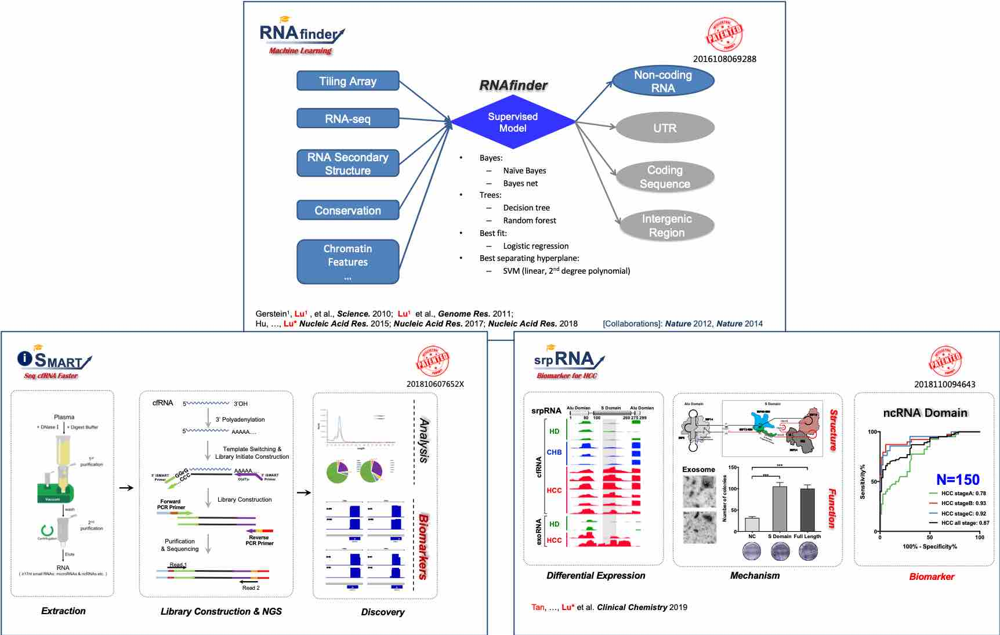

## 检测方向相关专利和软件著作权

1. 基于机器学习的生物信息方法 **RNAfinder**（**专利号：201610806928.8**）(*Science* 2010; *Genome Res.* 2011; *Nucleic Acids Res.* 2015;2017a;2018)
2. 痕量RNA捕获和测序技术i-SMART (**专利号：201810607652X**）(*Briefings in Bioinformatics* 2018; *Cell Research* 2020)
3. 针对肝癌早期检测和复发监测的一个新型非编码exRNA标志物（**专利号:201811009464.3**）(*Nature Comminications* 2017; *Clinical Chemistry* 2019)
4. 一种用于肝细胞癌早期筛查和复发监测的3-ncRNA系统 (**专利号：202010927225.7**)（*Theranostics* 2021)
5. 体液样本中鉴定新型exRNA生物标志物的试剂盒及配套机器学习算法 (**专利申请号：202010618721.4**)（*Nuc. Acid Res.* 2024)
6. 痕量RNA捕获和测序技术DETECTOR-seq (**专利申请号：202210579444.X**) (*elife* 2022, *Cell Rep. Med.* 2023, *Clinic. & Tranl. Med.* 2024)
7. 多组学 AI整合方法 **PathFormer** (**软件著作权号：2023SR0985659**) (*Bioinformatics* 2024a)
8. 一种细胞游离RNA（cfRNA）峰区识别的AI软件 **cfPeak** （**软件著作权号：2025SR1268709**）（*Genome Biology* 2025）

 

## 制药方向相关专利和软件著作权

1. RNA-protein 结合及调控**数据库** **POSTAR**（**软件著作权号：2016R11S367236**）(*Genome Biology* 2017; *Nucleic Acids Res.* 2017b; 2019; 2022)
2. 小RNA药物 AI 设计软件 **OligoFormer** (**软件著作权号：2024SR0808920**) (*Bioinformatics* 2024b)
3. 小分子药物 AI 设计软件 **RNAsmol** (**软件著作权号：2025SR1112526**) (*Nature Comput. Sci.* 2025)

