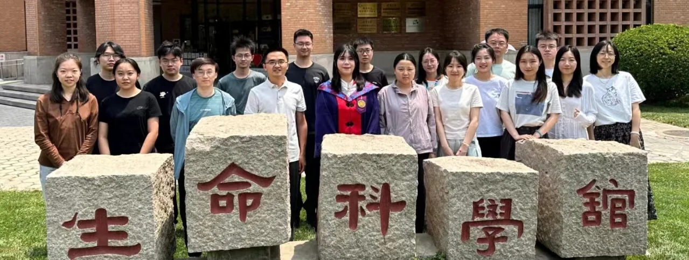
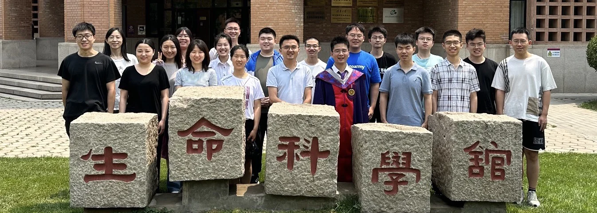
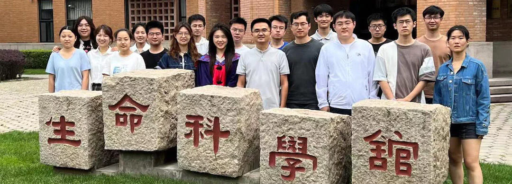
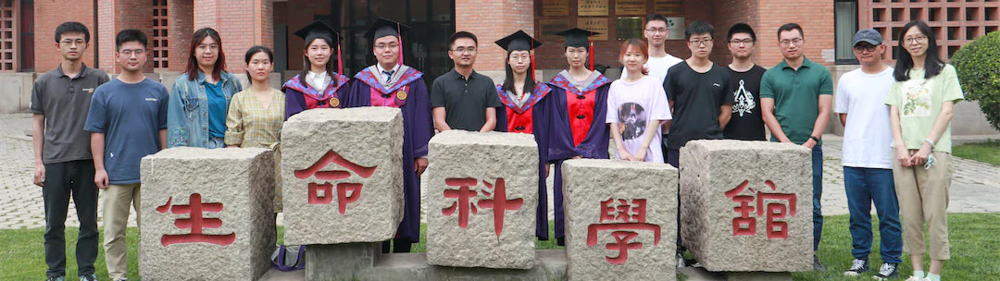
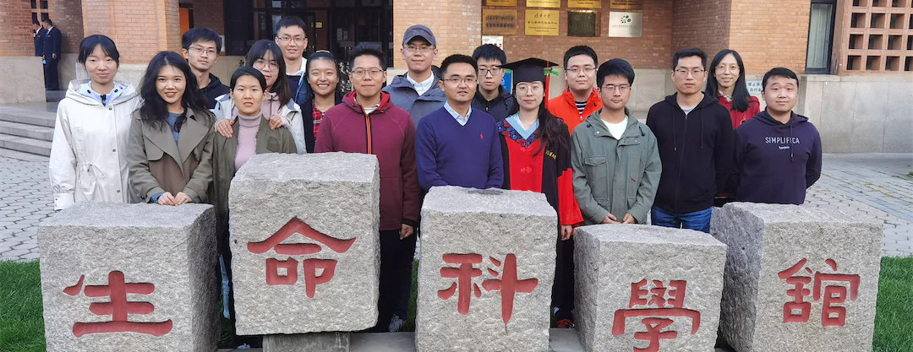
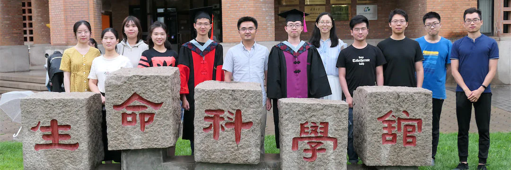
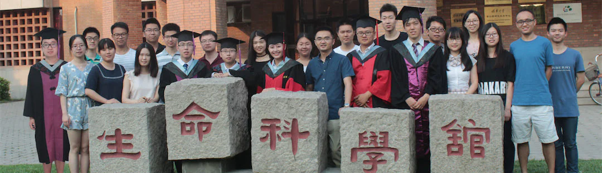
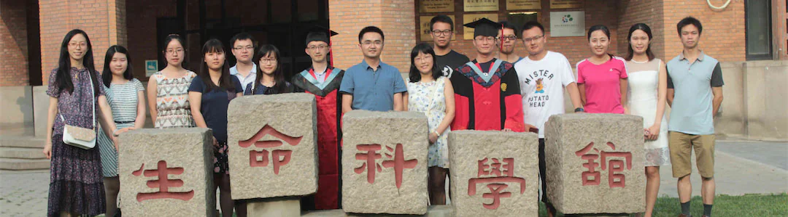

"What sculpture is to a block of marble, education is to a human soul." - Joseph Addison

“The carving and chipping away to create a masterpiece **take years of dedication**. 
Teachers help students **discover their interests, passions, and ultimately themselves**.”

   2024 
   
“<big>少年应有鸿鹄志，当骑骏马踏平川</big>” 

   

   2023 
   

 2021 

 2022  

   

 2019 

 2020  

   

 2017 

 2018  

   

 2016 

[More Photos ...](https://cloud.tsinghua.edu.cn/d/97e8ead7974a461499d3/?p=%2F&mode=grid)

  

---

* [Lab Members & Alumni](https://cloud.tsinghua.edu.cn/f/146aaa65df0641ff9fd4/)
* [Academic Tree](../academic.md)

