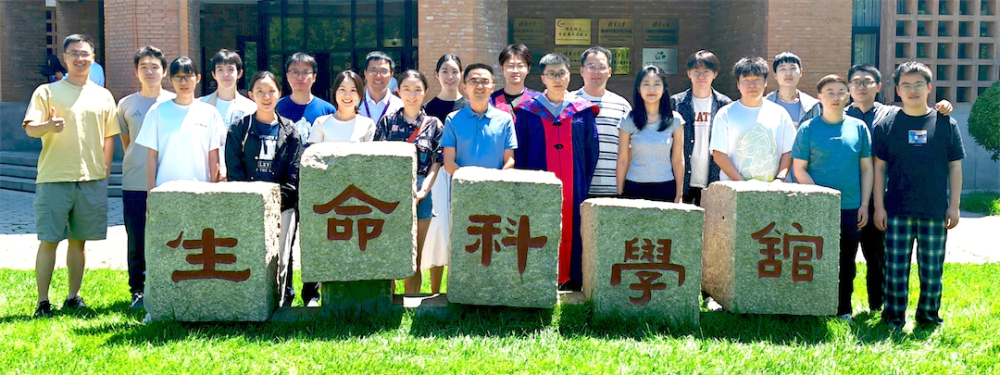
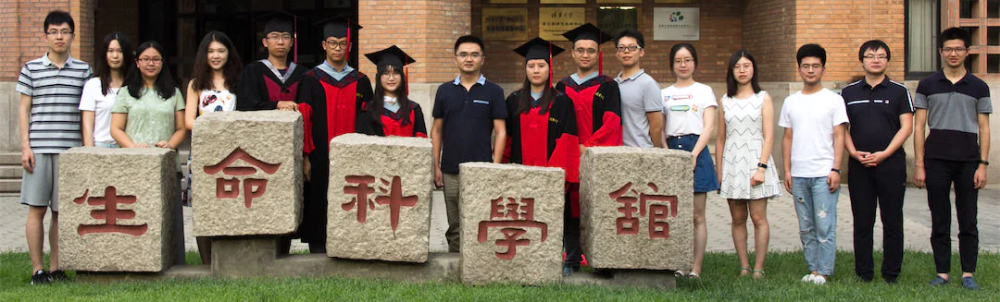

<a href="https://365.kdocs.cn/l/crmAWAhGmoRE"><big><b>《光荣榜》</b></big>  Honored Students @ Lu Lab</a>
  
“<big>少年应有鸿鹄志，当骑骏马踏平川</big>” 
 
 

 2025 
 
"What sculpture is to a block of marble, education is to a human soul."  --  Joseph Addison
 
“The carving and chipping away to create a masterpiece <b>take years of dedication</b>.  Teachers help students <b>discover their interests, passions, and ultimately themselves</b>.”
   

 2023 

 2024  
   

 2021 

 2022  
   

 2019 

 2020  
   

 2017 

 2018  
   

 2016 

[More Photos ...](./photos.md)

  

* [Lab Members & Alumni](https://cloud.tsinghua.edu.cn/f/146aaa65df0641ff9fd4/)
* [Academic Tree](../academic.md)

