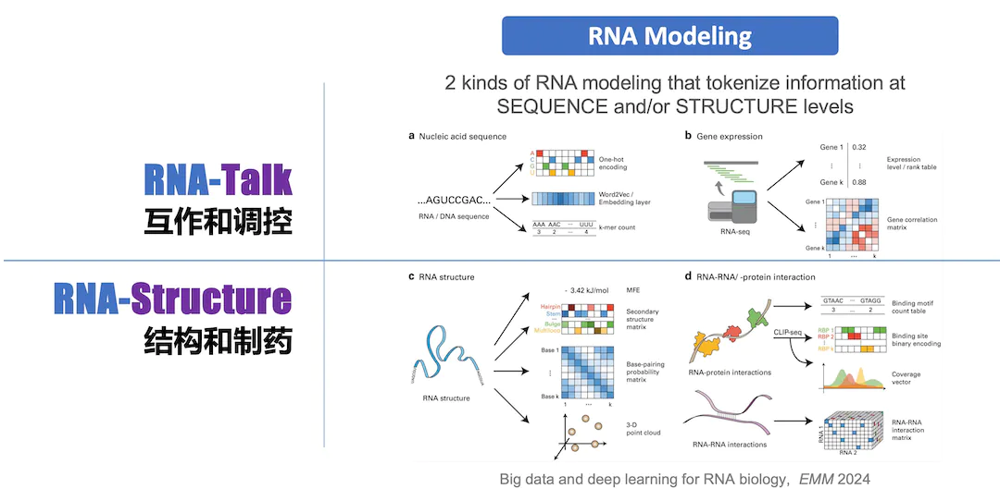
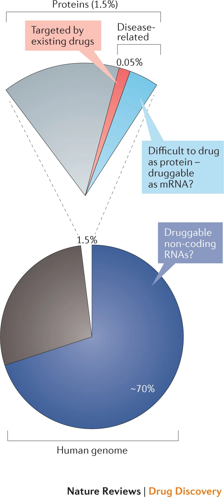

【[中文版](./index.md)】

---

* TOC
{:toc}

## Goals 

> “**RNA**, not DNA, is **the computational engine of the cell.**” ( [Revolutionary Genetics Research Shows RNA May Rule Our Genome \| *Scientific American*](https://www.scientificamerican.com/article/revolutionary-genetics-research-shows-rna-may-rule-our-genome/) 2024.7. Cover Story).  

We develop **bioinformatics** technology on **noncoding RNAs** from multiple perspectives/models of RNA structure and post-transcriptional regulation (e.g., splicing and editing); and explore its practice in the precise diagnosis and treatment of complex diseases. We utilize bioinformatics based on **new AI technologies** and **multi-omics data** to explore novel targets in the form of noncoding RNA in complex diseases such as **cancer and autoimmune diseases**, through cooperation with front-line doctors and experts.  While studying RNA regulation network, some targets can be used as biomarkers for personalized and precise diagnosis and treatment, and some targets can be used as drug targets for drug design through AI. 

## Background

About 20 thousand protein-coding genes in human were transcribed and tranlsated from only ~1.5% of human genome sequence. On the other hand, ~70% or more of the human genome  are transcribed into RNAs. Many of them are **noncoding RNAs** (**ncRNAs**), which are not well studied yet.

“By 2020 the ENCODE project said it had identified around 37,600 noncoding genes—that is, DNA stretches with instructions for RNA molecules that do not code for proteins. That is almost twice as many as there are protein-coding genes. Other tallies vary widely, from around 18,000 to close to 96,000. … In a 2024 commentary for the journal *Science*, the duo described these findings as part of an <u>RNA revolution</u>. … they undercut the way we think our biology works. Ever since the epochal discovery about DNA’s double helix and how it encodes information, the bedrock idea of molecular biology has been that there are precisely encoded instructions that program specific molecules for particular tasks. But **ncRNAs seem to point to a fuzzier, more collective, logic to life**. It is a logic that is harder to discern and harder to understand. But if scientists can learn to live with the fuzziness, this view of life may turn out to be more complete.” ( [Revolutionary Genetics Research Shows RNA May Rule Our Genome \| *Scientific American*](https://www.scientificamerican.com/article/revolutionary-genetics-research-shows-rna-may-rule-our-genome/) 2024.7. Cover Story)

***RNA regulation in immune system.*** RNAs are dynamicly regulated during transcription. In addition, after RNA is transcribed, it will also have very complex and fine post-transcriptional regulation, such as alternative splicing (AS), alternative polyadenylation (APA), degradation, editing, modification, cellular localization and so on. These are closely related to the structure of RNA itself and the proteins that recognize RNA sequence and structure. At the same time, RNAs, especially noncoding RNAs (ncRNAs), also regulate other macromolecules, thus playing important roles in innate immune response to viruses and cancer immunity. We explore these complex regulatory processes in complex diseases such as **cancer and autoimmune diseases**, which are applied to immunotherapy.

## Methods

We work on two major research projects centered on noncoding RNA (ncRNA): I. Bioinfo-Driven **Precision Medicine**, II. AI-Driven **RNA Modeling & Drug Design**. Leveraging new **AI technologies** for **RNA modeling** (i.e., RNA-Talk models) that tokenize information at **sequence** and/or **structure** levels, we discover and decipher the various molecular interactions and biological regulatory networks mediated by RNA. 

  
   
  <small>RNA Modeling</small>

## Projects & Subgroups

### A1. RNAfinder

***Discoverying novel noncoding RNAs.*** With the advancement of sequencing technology, especially the development and maturity of sequencing technology at the single-cell and single-molecule level, we have the ability to discover new noncoding RNAs from more species, more tissues, and more cell types. For example, we can discover and study new noncoding RNAs under different environments and conditions from **Transposable Elements** of human genome, **Meta-transcriptome** of diverse microbial communities. These studies will not only expand our understanding of the diversity of life, but may also reveal new biological mechanisms cross-species.

***cell-free RNAs (cfRNAs).*** The cfRNA content in clinical plasma samples is very low and fragmented. Therefore, it is necessary to solve the problems of low signal-to-noise ratio and high cost of sequencing data. We apply technologies such as TSO, early barcoding, UMI, and CRISPR-Cas9 to develop novel cfRNA-seq technologies that reduce the cost of high-throughput sequencing, and improve the signal-to-noise ratio of sequencing data.

> In clinical studies like liquid biopsy, **exRNA** (extra-cellular RNA) is also called **cfRNA** (cell free RNA). Many exRNAs are **noncoding RNAs** (**ncRNAs**), like miRNA, lncRNA, srpRNA, circRN, etc. 

 
<small>Different NGS (next-generation sequencing) libraries of cfRNAs</small>

***double-stranded RNA (dsRNA).*** Three well-known types of noncoding RNA include miRNA, siRNA, and piRNA. These are distinct RNA types generated through double-stranded RNA (dsRNA) processing. Double-stranded RNA (dsRNA) is a molecule composed of two complementary RNA strands. RNA interference typically requires dsRNA, which can be introduced exogenously (such as viruses) or produced endogenously (such as repetitive sequences in human genome). Advances in research have revealed that there are far more than just these three types of dsRNA. These diverse dsRNAs play important roles in the immune system, particularly in antiviral and anti-tumor immune responses. For example, srpRNAs exert intercellular regulatory functions through exosome trafficking within the cancer microenvironment.

More Reading: [**dsRNA code**](https://book.ncrnalab.org/teaching/part-v.-assignments/3.rna-regulation-dsrna)

 
<small>Different types of dsRNAs in immune response</small>

### A2. RNAfinder - Applications

#### A2.1 [**Medicine**] Precision Medicine

***Clinical applications.*** By applying the above methods to liquid biopsy, we help many clinical studies like cancer screen.

By integrating transcriptomics data with other multiomics data, we aim to explain development of complex diseases based on an integrative, multi-dimensional level.  We develop sequencing and bioinformatics methods to study cellular and extracellular transcriptome of **coding and noncoding RNAs (ncRNAs)** for varous immune cells of patients at the single-cell level and multi-molecular level. 

Accurately selecting the best diagnosis and treatment plan is important but difficult for complex diseases. For instance, some targeted drugs have been approved for many complex diseases, but the which benefit groups of different drugs are not yet clear, requiring accurate biomarkers. Therefore, by combining the immune cell data m with cfDNA/cfRNA in plasma and clinical data, we develop a drug-efficacy prediction model to provide a multi-modal biomarker for a precise drug instruction in the treatment of complex diseases. Meanwhile, we explore deep learning, transfer learning, similarity network fusion and other bioinformatics analysis techniques for these data. 

We apply the above methods to precision medicine, focusing on two types of diseases:  **1) Immune-medicated diseases；2) Cancer**.

> **Cancer and autoimmune diseases are like two sides of a coin**: if cancer cells escape the immune system's surveillance through some mechanism and cannot be eliminated, malignant tumors begin to grow; and when normal cells break the body's original immune tolerance mechanism for some reason, autoimmune diseases may be caused. "  
> -- Reverse Vaccine: A Miraculous Solution to Autoimmune Diseases, *Scientific American*, 2024.12.

***Multi-modal data integration.*** Multiple regulation events (e.g., expression, splicing, editing, fusion) can be quantified by bioinformatic analysis from NGS data like cfRNA-seq.  For the multi-modal data, such as cfRNA-seq derived multi-view data and/or multi-omics data, we need 4 steps for machine learning analysis, including 1) Data Cleaning, 2) Feature extraction and engineering, 3) Model Fitting, 4) Classifier. We develop corresponding bioinformatics method, software, database and other tools for these four steps. For instance, we integrate these multi-modal data using new AI technologies like large language and deep learning models. 

 
<small>Multi-dimensional data for liquid biopsy of cancer (Heitzer et al., Nature Reviews 2019) </small>

---

#### A2.2 [**Ribozyme**] Structure Prediction & Ribozyme Design

  
   
  <small>Prediction of 2D and 3D structure of RNA</small>

**_RNA structure prediction._**  We develop structure prediction models and algorithms for RNA. The accurate prediction of RNA structure will help us better understand its regulation and function, thus improving RNA-based enzyme and vaccince design. For instance, mRNA, as well as other RNAs like circular RNA, can be used as RNA vaccines. In the design of RNA vaccines, the design of RNA structure, codons and modifications are very important research directions. Improving the stability of RNA in storage and transportation, and the effectiveness and targeting of delivery to cells and the human body are very important and cutting-edge research directions.

**_RNA Design._**  The introduction of new methods and new thinking in different fields can often lead to breakthrough progress in this discipline, so we pay special attention to introducing new technologies and new thinking in the latest computing field (such as **new AI technologies** based on large language models) into biological data. We develop novel RNA models to explore basic scientific questions such as the structure, regulation and target of RNA, especially **noncoding RNA** (**ncRNA**). Finally, these novel models will bring us a new era of **enzyme, vaccine and drug design**.

---

### B1. RNAtarget

  
   
  <small>RNAs Talk: Language of RNA</small>

***RNA-RNA interaction (trans-pair)*** (RNA targeting RNA) plays a crucial role in various biological processes, including gene regulation, RNA processing, and viral replication. Predicting RNA-RNA interactions involves identifying and characterizing the binding sites between two RNA molecules, which can provide insights into their functional relationships and regulatory mechanisms. It's important to note that predicting RNA-RNA interactions remains a challenging problem due to the complexity of RNA structures, the vast sequence space, and the limited availability of experimentally validated interaction data. Therefore, the accuracy of predictions can vary depending on the specific method used and the quality of input data. We develop and refine computational approaches for predicting RNA-RNA interactions, aiming to improve the understanding of RNA biology and facilitate the discovery of new therapeutic targets and RNA-based regulatory mechanisms.

---

### B2. RNAtarget - Applications

#### B2.1 **siRNA** Drug Design

**_siRNA design._** Small interfering RNA (siRNA) has become a widely used experimental approach for post-transcriptional regulation and is increasingly showing its potential as future targeted drugs. However, the prediction of highly efficient siRNAs is still hindered by dataset biases, the inadequacy of prediction methods, and the presence of off-target effects. To overcome these limitations, we develop novel AI approaches for the prediction and design of efficient siRNA.

#### B2.2 **Small-molecule** Drug Design

**_Small molecule drug design targeting RNA._** The number of human proteins that can be used as small-molecule drug targets is very limited：Of the ~20 thousand protein-coding genes in human (~1.5% of human genome sequence),  about 10%-15% are directly related to diseases; among these genes, it is estimated that less than 700 protein products are druggable (only ~0.05% of human genome sequence). On the other hand, ~70% or more of the human genome  are transcribed into RNAs. Most of them are **noncoding RNAs** (**ncRNAs**). In recent years, more and more researchers have tried to use RNA as a drug target, and initially proved the feasibility of this strategy. In particular, it is worth noting that Coronavirus (COVID-19) is an RNA virus, and its genome itself is also promising as a drug target. In addition, using noncoding RNA for disease treatment is also a promising research direction, for example, siRNA-based RNA interference (RNAi) system has aleady been used to develop new gene therapy methods. Due to the high complexity and variability of RNA structure and the limitations of experimental methods, our current understanding of the three-dimensional structure of RNA is still very limited, and the development of RNA-targeting drugs is still in its infancy. We will use the latest artificial intelligence technologies such as deep learning to integrate various information,  and subsequently to design drugs targeting RNAs. 

  
   
  <small>The potential RNA-targeted druggable genome (Warner, et al., <i>Nature Reviews | Drug Discovery</i>  2018)</small>

---

## Funding

* 2024-2027     Precision diagnosis and treatment and innovative therapy research for refractory autoimmune diseases (AIDs), co-PI, National Key Research and Development Program of China
* 2024-2027     Development of high-throughput analysis  technology of non-coding RNA and its  clinical applicationd, key member, National Key Research and Development Program of China
* 2024-2027     Bioinformatics study of noncoding RNA omics in precision diagnosis and treatment of autoimmune diseases, PI, National Natural Science Foundation of China
* 2024-2026     AI-driven drug design targeting RNAs, PI, National Natural Science Foundation of China
* 2022-2025     Bioinformatics study of body fluid multi-omics data integration for cancer diagnosis Novel, PI, National Natural Science Foundation of China
* 2022-2025     Multi-Omics study for personalized neoadjuvant therapy of HCC, co-PI, Tsinghua Precision Medicine Institute
* 2024-2027     cfRNA-based multi-omics application research in lung cancer screening, PI,  Hefei Comprehensive National Science Center General Health Research Institute "Global Selection" Project 
  