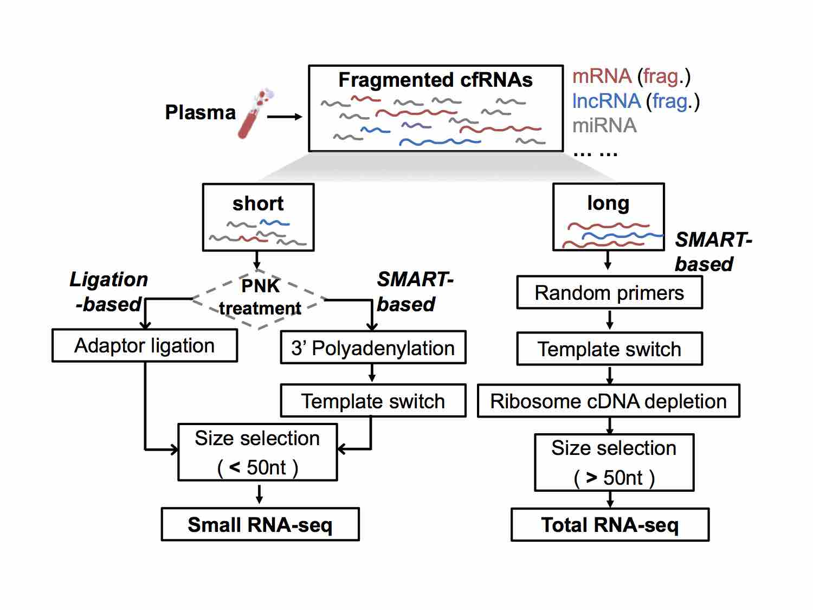
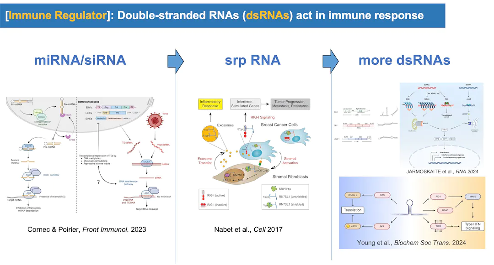
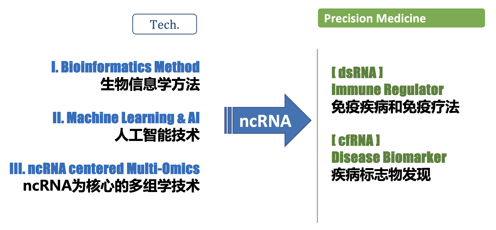
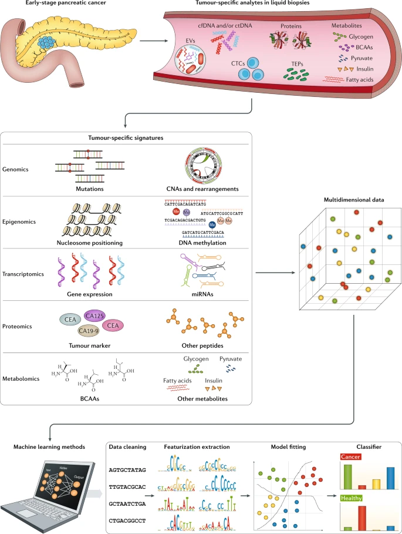
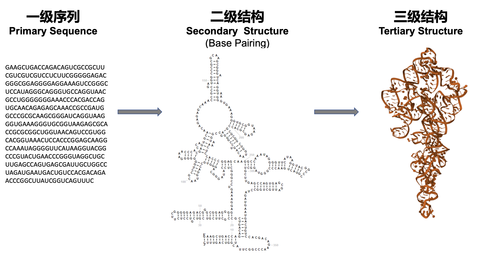

* TOC
{:toc}

## Goals 

> “**RNA**, not DNA, is **the computational engine of the cell.**” ( [Revolutionary Genetics Research Shows RNA May Rule Our Genome \| *Scientific American*](https://www.scientificamerican.com/article/revolutionary-genetics-research-shows-rna-may-rule-our-genome/) 2024.7. Cover Story).  
> 
> “RNA 而不是 DNA 才是**细胞的计算引擎**。” （ [RNA: 掌控生命后台 \| 《环球科学》](https://www.huanqiukexue.com/?p=1121) 2024年7月刊封面文章）

We develop **bioinformatics** technology on **noncoding RNAs** from multiple perspectives/models of RNA structure and post-transcriptional regulation (e.g., splicing and editing); and explore its practice in the precise diagnosis and treatment of complex diseases. We utilize bioinformatics based on **new AI technologies** and **multi-omics data** to explore novel targets in the form of noncoding RNA in complex diseases such as **cancer and autoimmune diseases**, through cooperation with front-line doctors and experts.  While studying RNA regulation network, some targets can be used as biomarkers for personalized and precise diagnosis and treatment, and some targets can be used as drug targets for drug design through AI. 

我们围绕**非编码RNA**发展**生物信息学**技术，从结构和转录后调控（例如剪接和编辑）等多个角度、多个模型探讨非编码RNA的调控作用，并探索其在复杂疾病精准诊疗上的具体实践。我们充分发挥生物信息学这一交叉学科优势，利用**最新的AI技术**和**多组学数据**，通过和【北京协和】、【北大一院】、【清华长庚】等一线医生专家的合作，在**癌症、自身免疫疾病**等复杂疾病上探索新的以非编码 RNA 为表现形式的靶标。在研究其免疫调控网络的同时，部分靶标可以应用为个性化精准诊疗时的生物标志物，部分靶标可以做为药物靶点通过AI进行药物设计，在复杂疾病（如癌症和自身免疫疾病）的临床诊断和治疗两个方面实现应用价值。

## Background

About 20 thousand protein-coding genes in human were transcribed and tranlsated from only ~1.5% of human genome sequence. On the other hand, ~70% or more of the human genome  are transcribed into RNAs. Many of them are **noncoding RNAs** (**ncRNAs**), which are not well studied yet.

“By 2020 the ENCODE project said it had identified around 37,600 noncoding genes—that is, DNA stretches with instructions for RNA molecules that do not code for proteins. That is almost twice as many as there are protein-coding genes. Other tallies vary widely, from around 18,000 to close to 96,000. … In a 2024 commentary for the journal *Science*, the duo described these findings as part of an <u>RNA revolution</u>. … they undercut the way we think our biology works. Ever since the epochal discovery about DNA’s double helix and how it encodes information, the bedrock idea of molecular biology has been that there are precisely encoded instructions that program specific molecules for particular tasks. But **ncRNAs seem to point to a fuzzier, more collective, logic to life**. It is a logic that is harder to discern and harder to understand. But if scientists can learn to live with the fuzziness, this view of life may turn out to be more complete.” ( [Revolutionary Genetics Research Shows RNA May Rule Our Genome \| *Scientific American*](https://www.scientificamerican.com/article/revolutionary-genetics-research-shows-rna-may-rule-our-genome/) 2024.7. Cover Story)

人类有大约2万个蛋白编码基因，但其序列的总长度仅占人类基因组总长度的1.5%左右。另一方面，人类基因组序列的~70%甚至更多都会被转录成RNA，它们很多都是非编码的RNA（**noncoding RNA**，**ncRNA**)。但对于为数众多的**非编码RNA** (**ncRNA**)，我们仍然知之甚少。

”截止2020 年，ENCODE 项目已鉴定出约 37,600 个非编码RNA的基因，这几乎是蛋白质编码基因的两倍。其他统计数据相差很大，从约 18,000 个到接近 96,000 个。... 在 2024 年《科学》杂志的一篇评论中，将这些发现描述为 <u>RNA 革命</u> 的一部分。... 这些非编码RNA动摇了我们对生物学运作方式的理解。自从关于 DNA 双螺旋结构及其如何编码信息的划时代发现以来，分子生物学的基本思想一直是，生物体存在精确编码的指令，这些指令可以对特定分子进行特定任务编程。但**非编码RNA 似乎指向了一种更模糊、更集体的生命逻辑**。这种逻辑更难辨别，更难理解。但如果科学家能够学会适应这种模糊性，这种关于生命的观点可能会更加完整。“ （ [RNA: 掌控生命后台 \| 《环球科学》](https://mp.weixin.qq.com/s/ai_8lNXsluNz4Pu_piGA-g) 2024年7月刊封面文章）

***RNA regulation in immune system.*** RNAs are dynamicly regulated during transcription. In addition, after RNA is transcribed, it will also have very complex and fine post-transcriptional regulation, such as alternative splicing (AS), alternative polyadenylation (APA), degradation, editing, modification, cellular localization and so on. These are closely related to the structure of RNA itself and the proteins that recognize RNA sequence and structure. At the same time, RNAs, especially noncoding RNAs (ncRNAs), also regulate other macromolecules, thus playing important roles in innate immune response to viruses and cancer immunity. We explore these complex regulatory processes in complex diseases such as **cancer and autoimmune diseases**, which are applied to immunotherapy.

***RNA regulation in immune system:*** RNA不仅在转录时被动态调控，而且在被转录后也会有着非常复杂而精细的调控工程，例如剪接，修饰，细胞定位，编辑，加尾，降解等等。而这些又和RNA自身的结构以及识别RNA序列和结构的蛋白息息相关。同时，RNA，尤其是非编码 RNA (ncRNA)，还会调控其他大分子，从而在人体对病毒的免疫应答以及癌症免疫等重要生命过程中发挥作用。我们在**癌症、自身免疫**等复杂性疾病中探索这些复杂的调控过程，并应用于免疫治疗。

## Methods

We work on two major research projects centered on noncoding RNA (ncRNA): I. Bioinfo-Driven **Precision Medicine**, II. AI-Driven **RNA Modeling & Drug Design**. Leveraging new **AI technologies** for **RNA modeling** (i.e., RNA-Talk models) that tokenize information at **sequence** and/or **structure** levels, we discover and decipher the various molecular interactions and biological regulatory networks mediated by RNA. 

我们围绕非编码 RNA（ncRNA）在两个主要的科研方向上进行探索和研究：I. 生信驱动的**精准医疗**；II. AI驱动的**核酸模型和药物设计**。我们利用最新的**人工智能技术**从“**序列**”和“**结构**”两个不同的表征层面开发各类核酸模型，去发现和理解RNA在复杂的生物分子互作和调控网络中的作用和机制。

  
   
  <small>RNA Modeling</small>

## Projects & Subgroups

### A1. RNAfinder

***Discoverying novel noncoding RNAs.*** With the advancement of sequencing technology, especially the development and maturity of sequencing technology at the single-cell and single-molecule level, we have the ability to discover new noncoding RNAs from more species, more tissues, and more cell types. For example, we can discover and study new noncoding RNAs under different environments and conditions from **Transposable Elements** of human genome, **Meta-transcriptome** of diverse microbial communities. These studies will not only expand our understanding of the diversity of life, but may also reveal new biological mechanisms cross-species.

***Discoverying novel noncoding RNAs:*** 随着测序技术的进步，尤其是单细胞、单分子水平的测序技术的发展和成熟，我们有能力从更多物种、更多组织、更多细胞类型中发现新的非编码RNA。例如，我们可以从人类基因组的各类重复区域（**Transposable Elements**）、纷繁复杂的微生物群落的宏转录组（**Meta-transcriptome of Microbes**）中发现和研究不同环境和条件下的新非编码 RNA。这些研究不仅将扩大我们对生命多样性的理解，还可能揭示新的、跨物种的生物学机制。

***cell-free RNAs (cfRNAs).*** The cfRNA content in clinical plasma samples is very low and fragmented. Therefore, it is necessary to solve the problems of low signal-to-noise ratio and high cost of sequencing data. We apply technologies such as TSO, early barcoding, UMI, and CRISPR-Cas9 to develop novel cfRNA-seq technologies that reduce the cost of high-throughput sequencing, and improve the signal-to-noise ratio of sequencing data.

> In clinical studies like liquid biopsy, **exRNA** (extra-cellular RNA) is also called **cfRNA** (cell free RNA). Many exRNAs are **noncoding RNAs** (**ncRNAs**), like miRNA, lncRNA, srpRNA, circRN, etc. 

***cell-free RNAs (cfRNAs):*** 临床血浆样本中的 cfRNA 含量很低且碎片化，需要解决测序数据信噪比低、成本昂贵等问题。我们应用模板转换、早期标记、分子标签和CRISPR-Cas9等技术，开发新型 cfRNA-seq 技术，降低构建高通量测序文库的经济成本并提高了测序数据的信噪比。

> **exRNA** (extra-cellular RNA) 在很多临床研究尤其是液体活检研究中又称为 **cfRNA** (cell free RNA) ，包括了很多**非编码 RNA** (**ncRNA**)，如 miRNA，lncRNA，srpRNA，circRNA等。

 
<small>Different NGS (next-generation sequencing) libraries of cfRNAs</small>

***double-stranded RNA (dsRNA).*** Three well-known types of noncoding RNA include miRNA, siRNA, and piRNA. These are distinct RNA types generated through double-stranded RNA (dsRNA) processing. Double-stranded RNA (dsRNA) is a molecule composed of two complementary RNA strands. RNA interference typically requires dsRNA, which can be introduced exogenously (such as viruses) or produced endogenously (such as repetitive sequences in human genome). Advances in research have revealed that there are far more than just these three types of dsRNA. These diverse dsRNAs play important roles in the immune system, particularly in antiviral and anti-tumor immune responses. For example, srpRNAs exert intercellular regulatory functions through exosome trafficking within the cancer microenvironment.

***double-stranded RNA (dsRNA):*** 著名的非编码RNA有miRNA/siRNA/piRNA这三类small RNA，他们是通过双链RNA（dsRNA）加工生成的不同RNA类型。双链RNA（double stranded RNA, dsRNA）是一种由两条互补RNA链组成的分子，RNA干扰的启动通常需要双链RNA（dsRNA），这些双链RNA可以是外源（如病毒）引入的，也可以是内源（如人类基因组里的重复序列）产生的。随着科研的进展，人们发现双链RNA（dsRNA）远不止上述3种。这些不同的dsRNAs在免疫系统中具有重要作用，尤其是在抗病毒和抗肿瘤免疫反应中。比如，srpRNA就通过癌症微环境的外泌体运输发挥细胞间的调控功能。

 
<small>Different types of dsRNAs in immune response</small>

More Reading: [dsRNA code](https://book.ncrnalab.org/teaching/part-v.-assignments/3.rna-regulation-dsrna)

### A2. RNAfinder - Applications

#### A2.1 [**Medicine**] Precision Medicine

***Clinical applications.*** By applying the above methods to liquid biopsy, we help many clinical studies like cancer screen.

***Clinical applications:*** 我们将上述方法应用在液体活检上，助力解决临床问题，例如癌症早筛。

By integrating transcriptomics data with other multiomics data, we aim to explain development of complex diseases based on an integrative, multi-dimensional level.  We develop sequencing and bioinformatics methods to study cellular and extracellular transcriptome of **coding and noncoding RNAs (ncRNAs)** for varous immune cells of patients at the single-cell level and multi-molecular level. 

Accurately selecting the best diagnosis and treatment plan is important but difficult for complex diseases. For instance, some targeted drugs have been approved for many complex diseases, but the which benefit groups of different drugs are not yet clear, requiring accurate biomarkers. Therefore, by combining the immune cell data m with cfDNA/cfRNA in plasma and clinical data, we develop a drug-efficacy prediction model to provide a multi-modal biomarker for a precise drug instruction in the treatment of complex diseases. Meanwhile, we explore deep learning, transfer learning, similarity network fusion and other bioinformatics analysis techniques for these data. 

We apply the above methods to precision medicine, focusing on two types of diseases:  **1) Immune-medicated diseases；2) Cancer**.

> **Cancer and autoimmune diseases are like two sides of a coin**: if cancer cells escape the immune system's surveillance through some mechanism and cannot be eliminated, malignant tumors begin to grow; and when normal cells break the body's original immune tolerance mechanism for some reason, autoimmune diseases may be caused. "  
> -- Reverse Vaccine: A Miraculous Solution to Autoimmune Diseases, *Scientific American*, 2024.12.

通过将转录组学数据与其他多组学数据整合，我们旨在从综合的、多维的水平上去解释复杂疾病的发展。 我们开发测序和生物信息学方法来研究**编码和非编码 RNA (ncRNA)** 的细胞和细胞外转录组，从单细胞水平和多分子水平研究患者各种免疫细胞内外编码和非编码基因的调控图谱。

对于复杂疾病来说，准确选择最佳的诊疗方案很重要，但也很困难。 例如，一些靶向药物已被批准用于许多复杂疾病，但不同药物的受益人群尚不清楚，需要准确的生物标志物。 因此，通过将免疫细胞数据与血浆中的cfDNA/cfRNA数据以及临床数据相结合，我们开发药效预测模型，为治疗复杂疾病的精确药物指导提供多模态标志物模型。同时，我们针对这些数据探索深度学习、迁移学习、相似性网络融合，以及其他生物信息学分析技术。

我们将上述方法应用于精准医疗，重点关注两类疾病：**1）自身免疫疾病；2）癌症**。

> “**癌症和自身免疫疾病，这两者就像硬币的两面**：若癌细胞通过某种机制逃脱了免疫系统监视、无法被清除，恶性肿瘤便开始滋长；而当正常细胞因某种原因打破了身体原本的免疫耐受机制，就可能引发自身免疫疾病。” 
> -- 反向疫苗：自身免疫病奇解《环球科学》(*Scientific American*) 2024年12月号

***Multi-modal data integration.*** Multiple regulation events (e.g., expression, splicing, editing, fusion) can be quantified by bioinformatic analysis from NGS data like cfRNA-seq.  For the multi-modal data, such as cfRNA-seq derived multi-view data and/or multi-omics data, we need 4 steps for machine learning analysis, including 1) Data Cleaning, 2) Feature extraction and engineering, 3) Model Fitting, 4) Classifier. We develop corresponding bioinformatics method, software, database and other tools for these four steps. For instance, we integrate these multi-modal data using new AI technologies like large language and deep learning models. 

***Multi-modal data integration:***  我们可以由cfRNA-seq等高通量测序方法通过生物信息分析计算得到多模态数据（例如表达、剪接、编辑、融合等）。对于这些多维度、多模态的高通量数据（例如 cfRNA-seq分析得到的多模态数据，以及multi-omics数据），我们需要进行4个步骤来进行机器学习等分析，包括 1) Data Cleaning, 2) Feature extraction and engineering, 3) Model Fitting, 4) Classifier。我们针对这4个步骤开发相应的生物信息学方法、软件、数据库等工具，例如，我们探索和利用大语言模型和深度学习模型等新型AI 技术，进行多模态数据整合。

 
<small>Multi-dimensional data for liquid biopsy of cancer (Heitzer et al., Nature Reviews 2019) </small>

---

#### A2.2 [**Ribozyme**] Structure Prediction & Ribozyme Design

  
   
  <small>Prediction of 2D and 3D structure of RNA</small>

**_RNA structure prediction._**  We develop structure prediction models and algorithms for RNA. The accurate prediction of RNA structure will help us better understand its regulation and function, thus improving RNA-based enzyme and vaccince design. For instance, mRNA, as well as other RNAs like circular RNA, can be used as RNA vaccines. In the design of RNA vaccines, the design of RNA structure, codons and modifications are very important research directions. Improving the stability of RNA in storage and transportation, and the effectiveness and targeting of delivery to cells and the human body are very important and cutting-edge research directions.

**_RNA structure prediction:_** 我们开发针对 RNA结构的预测模型和算法，对 RNA 结构的准确预测，将帮助我们更好地理解 RNA 的调控和功能，并应用于基于 RNA酶和RNA疫苗的设计。例如，mRNA，以及环装RNA（circular RNA）等，可以用来做为RNA疫苗。在 RNA 疫苗设计中，RNA 结构、密码子和修饰的设计都是非常重要的研究方向。不论是 RNA干扰还是RNA疫苗，提高RNA 在存储和运输中的稳定性，递送到细胞和人体内的有效性和靶向性，都是非常重要和前沿的研究方向。

**_RNA Design._**  The introduction of new methods and new thinking in different fields can often lead to breakthrough progress in this discipline, so we pay special attention to introducing new technologies and new thinking in the latest computing field (such as **new AI technologies** based on large language models) into biological data. We develop novel RNA models to explore basic scientific questions such as the structure, regulation and target of RNA, especially **noncoding RNA** (**ncRNA**). Finally, these novel models will bring us a new era of **enzyme, vaccine and drug design**.

**_RNA Design:_**  不同领域的新方法和新思维的引入，往往能带来本学科的突破性进展，所以我们尤其注意将最新的计算领域的新技术和新思维（例如基于大语言模型的**新型 AI 技术**）引入到生物数据的研究上。我们针对RNA，尤其是 **非编码 RNA** (**ncRNA**），的结构、调控和靶标等问题，开发新型的核酸模型。最终，这些新型的模型将会带领我们进入一个崭新思维的**酶设计、疫苗设计和药物设计**的新时代。

---

### B1. RNAtarget

  
   
  <small>RNAs Talk: Language of RNA</small>

***RNA-RNA interaction (trans-pair)*** (RNA targeting RNA) plays a crucial role in various biological processes, including gene regulation, RNA processing, and viral replication. Predicting RNA-RNA interactions involves identifying and characterizing the binding sites between two RNA molecules, which can provide insights into their functional relationships and regulatory mechanisms. It's important to note that predicting RNA-RNA interactions remains a challenging problem due to the complexity of RNA structures, the vast sequence space, and the limited availability of experimentally validated interaction data. Therefore, the accuracy of predictions can vary depending on the specific method used and the quality of input data. We develop and refine computational approaches for predicting RNA-RNA interactions, aiming to improve the understanding of RNA biology and facilitate the discovery of new therapeutic targets and RNA-based regulatory mechanisms.

***RNA-RNA interaction (trans-pair)*** : RNA靶向RNA在各种生物过程中发挥着至关重要的作用，包括基因调控、RNA加工和病毒复制。 预测 RNA-RNA 相互作用涉及识别和表征两个 RNA 分子之间的结合位点，这可以深入了解它们的功能关系和调控机制。 值得注意的是，由于 RNA 结构的复杂性、巨大的序列空间以及经过实验验证的相互作用数据的有限性，预测 RNA-RNA 相互作用仍然是一个具有挑战性的问题。 因此，预测的准确性可能会根据所使用的具体方法和输入数据的质量而有所不同。 我们开发和完善用于预测 RNA-RNA 相互作用的计算方法，旨在提高对 RNA 生物学的理解，并促进新的治疗靶点和基于 RNA 的调控机制的发现。

---

### B2. RNAtarget - Applications

#### B2.1 **siRNA** Drug Design

**_siRNA design._** Small interfering RNA (siRNA) has become a widely used experimental approach for post-transcriptional regulation and is increasingly showing its potential as future targeted drugs. However, the prediction of highly efficient siRNAs is still hindered by dataset biases, the inadequacy of prediction methods, and the presence of off-target effects. To overcome these limitations, we develop novel AI approaches for the prediction and design of efficient siRNA.

**_siRNA design:_** siRNA已成为一种广泛使用的转录后调控实验方法，并且越来越显示出其作为未来靶向药物的潜力。 然而，高效siRNA的预测仍然受到数据集偏差、预测方法的不足以及脱靶效应的存在的阻碍。为了克服这些限制，我们开发新的人工智能方法来预测和设计高效的siRNA。

#### B2.2 **Small-molecule** Drug Design

**_Small molecule drug design targeting RNA._** The number of human proteins that can be used as small-molecule drug targets is very limited：Of the ~20 thousand protein-coding genes in human (~1.5% of human genome sequence),  about 10%-15% are directly related to diseases; among these genes, it is estimated that less than 700 protein products are druggable (only ~0.05% of human genome sequence). On the other hand, ~70% or more of the human genome  are transcribed into RNAs. Most of them are **noncoding RNAs** (**ncRNAs**). In recent years, more and more researchers have tried to use RNA as a drug target, and initially proved the feasibility of this strategy. In particular, it is worth noting that Coronavirus (COVID-19) is an RNA virus, and its genome itself is also promising as a drug target. In addition, using noncoding RNA for disease treatment is also a promising research direction, for example, siRNA-based RNA interference (RNAi) system has aleady been used to develop new gene therapy methods. Due to the high complexity and variability of RNA structure and the limitations of experimental methods, our current understanding of the three-dimensional structure of RNA is still very limited, and the development of RNA-targeting drugs is still in its infancy. We will use the latest artificial intelligence technologies such as deep learning to integrate various information,  and subsequently to design drugs targeting RNAs. 

**_Small molecule drug design targeting RNA:_** 可作为小分子药物靶标的人类蛋白数量非常有限：在人类的2万个左右的蛋白编码基因（占人类基因组总长度的1.5%左右）中，大约有 10%-15%与疾病直接相关；而在这些基因中，据估计仅有不到 700 个的蛋白产物是可以成药的 （仅占人类基因组总长度的 0.05%左右）。另一方面，人类基因组的~70%甚至更多都会被转录成 RNA，其中大多是**非编码 RNA** (**ncRNA**)。因此，近年开始有越来越多的研究者试图将 RNA 作为药物靶标，并初步证明了这一策略的可行性。尤其值得我们注意的是，新冠病毒就是 RNA 病毒，其基因组本身也有希望被作为药物靶标。此外，利用非编码RNA进行疾病治疗也是一个有前景的研究方向，例如，基于 siRNA 的RNA干扰（RNA interference, RNAi）系统等已经被用于开发新的基因治疗方法。由于 RNA 结构的高度复杂性和可变性，以及实验方法的限制，目前我们对于 RNA 的三维结构的了解仍非常有限，靶向 RNA 的药物研发也处在起步阶段。 我们将充分发挥人工智能的优势，利用深度学习等最新的计算技术整合多方面的信息，设计新药物靶标RNA。

  
   
  <small>The potential RNA-targeted druggable genome (Warner, et al., <i>Nature Reviews | Drug Discovery</i>  2018)</small>

---

## Funding

* 2024-2027     Precision diagnosis and treatment and innovative therapy research for refractory autoimmune diseases (AIDs), co-PI, National Key Research and Development Program of China
* 2024-2027     Development of high-throughput analysis  technology of non-coding RNA and its  clinical applicationd, key member, National Key Research and Development Program of China
* 2024-2027     Bioinformatics study of noncoding RNA omics in precision diagnosis and treatment of autoimmune diseases, PI, National Natural Science Foundation of China
* 2024-2026     AI-driven drug design targeting RNAs, PI, National Natural Science Foundation of China
* 2022-2025     Bioinformatics study of body fluid multi-omics data integration for cancer diagnosis Novel, PI, National Natural Science Foundation of China
* 2022-2025     Multi-Omics study for personalized neoadjuvant therapy of HCC, co-PI, Tsinghua Precision Medicine Institute
* 2024-2027     cfRNA-based multi-omics application research in lung cancer screening, PI,  Hefei Comprehensive National Science Center General Health Research Institute "Global Selection" Project 

* 国家重点研发计划 重点专项，难治性自身免疫病精准诊治与创新疗法研究，2024.12-2027.11 课题组长
* 国家重点研发计划 重点专项，非编码RNA高通量解析技术与临床应用研发，2024.12-2027.11 课题骨干

* 国家自然科学基金 面上项目，82371855，自身免疫性疾病精准诊疗中基于非编码RNA组学和生物信息学的新方法研究，2024-2027  主持
* 国家自然科学基金 专项项目，82341101，基于AI技术的靶向RNA的药物设计，2024-2026  主持
* 国家自然科学基金 面上项目，32170671，体液多组学数据整合的生物信息学研究及其在癌症无创检测上的应用，2022-2025     主持
* 清华大学精准医学研究院 精准医疗战略项目， 基于多组学数据的智能化中晚期肝癌转化治疗决策研究，2022-2025 共同主持
* 合肥综合性国家科学中心大健康研究院“全球遴选”项目，LX202401，cfRNA为核心的多组学在肺癌筛查上的应用研究，2024-2027 主持

  