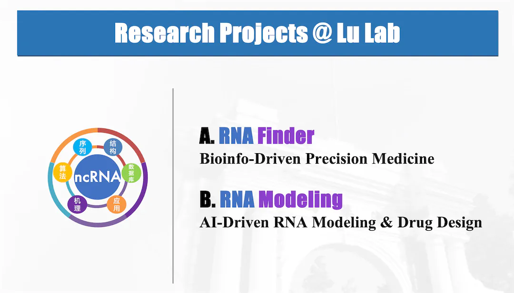

We are interested in developing bioinformatics technologies and practicing evidence-based medicine.
Here, we develop bioinformatic software about biological system, and applying them to RNA biology and Precision Medicine.

**Table of Contents:**

* TOC
{:toc}

> [Lu Lab's **Github**](https://github.com/lulab)
> 
> [Related Publications](../publications/pub.md)

---

## A. RNA-Finder

### A1. cfRNA-Finder

**cfPeak** 

>  Pengfei Bao, Taiwei Wang, et al. *Genome Biology* (2025)

A CNN model finding fragmented cell-free RNAs for disease diagnoisis and prognosis.

Github: [https://github.com/lulab/cfPeak](https://github.com/lulab/cfPeak)

**PathFormer** 

>  Xiaofan Liu, Yuhuan Tao, et al. *Bioinforamtics* (2024)

A Transformer model integrating multiomics data for disease diagnoisis and prognosis.

Github: [https://github.com/lulab/Pathformer](https://github.com/lulab/Pathformer)

**cfOmics Database** 

>  Mingyang Li, Tianxiu Zhou, Mingfei Han, et al. *Nucleic Acids Research* (2024)

Website: [https://cfOmics.ncRNAlab.org](https://cfOmics.ncRNAlab.org)

Multi-Omics data and diagnosis panels for liquid biopsy of cancer and other diseases.

### A2. ncRNA-Finder

[**V3. Ribowave**](https://lulab.github.io/Ribowave)

> Zhiyu Xu, Long Hu, et al. Nucleic Acids Research (2018)

Github: [https://github.com/lulab/Ribowave](https://github.com/lulab/Ribowave)

RiboWave analyses Ribosome profiling data (Ribo-seq). It utilizes wavelet transform to denoise the original signal by extracting 3-nt periodicity of ribosomes (i.e. signal frequency) and precisely locate their footprint.

[**V2. COME**](https://github.com/lulab/COME)

> Long Hu, et al. Nucleic Acids Research (2017)

Github: [https://github.com/lulab/COME](https://github.com/lulab/COME)

COME is a tool to calculate COding potential from Multiple fEatures for a given transcript. The models in COME were trained on mRNAs and long ncRNAs (lncRNAs).

[**V1. RNAfeature**](http://Rnafeature.ncrnalab.org)

Github: [https://github.com/lulab/RNAfinder](https://github.com/lulab/RNAfinder) \|  [https://github.com/lulab/RNAfeature](https://github.com/lulab/RNAfeature)

> Long Hu, et al. Nucleic Acids Research (2015)

RNAfeature provides a common set of conserved features for ncRNAs across multiple species. The models in RNAfeature were trained on canonical ncRNAs (e.g.,tRNAs,rRNAs, miRNAs, snRNAs, snoRNAs, 7SK RNAs, Y RNAs).

**CCG Database** (*deprecated*)

> Mengrong Liu, Yu-Cheng T. Yang, et al. *Discovery Medicine* (2016)

CCG, Catalogue of Cancer Genes/lncRNAs, is an assembly resource of coding and noncoding genes associated with cancer. In addition, drug-gene information in CCG provides a useful guide to the development of new anti-cancer drugs.

## B. RNA-Talk

### B1. [RNA-Seq] RNA Interaction & Regulation

**OligoFormer** 

>  Yilan Bai  et al. *Bioinformatics* (2024)

AI model designing **small RNA drug** targeting RNA. 

Github: [https://github.com/lulab/oligoformer](https://github.com/lulab/oligoformer)

[**RBPgroup**](http://RNAtarget.ncrnalab.org/RBPgroup)

> Yang Eric Li, Mu Xiao, Binbin Shi, Yu-Cheng T. Yang, et al. Genome Biology (2017)

Github: [https://github.com/lulab/RBPgroup](https://github.com/lulab/RBPgroup)

RBPgroup is a soft-clustering method on various CLIP-seq datasets, in order to group together RBPs that specifically bind the same RNA sites. Our approach links proteins and RNA motifs known to possess similar biochemical and cellular properties and can, when used in conjunction with additional experimental data, identify high- confidence RBP groups and their associated RNA regulatory elements.

[**V1-3. POSTAR Database**](https://POSTAR.ncRNAlab.org)

>  V3: Weihao Zhao, Shang Zhang, et al. Nucleic Acids Research  (2022)
>
>  V2: Yumin Zhu, Gang Xu, Yu-Cheng T. Yang,  et al. Nucleic Acids Research  (2017)
>
>  V1: Boqin Hu, Yu-Cheng T. Yang,  et al. Nucleic Acids Research  (2017)

Website: [https://POSTAR.ncRNAlab.org](https://POSTAR.ncRNAlab.org)

POSTAR is a platform for exploring post-transcriptional regulation coordinated by RNA-binding proteins. It enables the experimental biologists to connect protein-RNA interactions with multi-layer information of post-transcriptional regulation and functional genes, and helps them generate novel hypotheses about the post-regulatory mechanisms of phenotypes and diseases.

**V0. CLIPdb Database**

>  Yu-Cheng T. Yang, Chao Di, Boqin Hu, et al. BMC Genomics (2015)

Website: http://CLIPdb.ncRNAlab.org (moved into POSTAR)

CLIPdb is an integrative resource of CLIP-seq studies. It aims to characterize the regulatory networks between RNA binding proteins (RBPs) and various RNA transcript classes by integrating large amounts of CLIP-seq (including HITS-CLIP, PAR-CLIP and iCLIP as variantions) data sets.

### B2-1. [RNA-Structure] Structure Prediction

**RNAex Server** (*deprecated*)

>  Yang Wu, Rihao Qu, Yiming Huang, et al. Nucleic Acids Research (2016)

RNAex is an RNA secondary structure prediction server enhanced by high-throughput experimental data. We have re-mapped raw data of the published probing experiments to the whole genome, thus users can predict secondary structures for novel RNA transcripts.

[**RME**](https://github.com/lulab/RME)

>  Yang Wu, Binbin Shi, et al. Nucleic Acids Research (2015)

Github: [https://github.com/lulab/RME](https://github.com/lulab/RME)

RME is a tool for RNA secondary structure prediction with multiple types of experimental probing data. It is based on the [RNAstructure](http://rna.urmc.rochester.edu/RNAstructure.html) package. It also provides preprocessing scripts for transforming the SHAPE, PARS and DMS-seq data into pairing probability according a posterior probabilistic model. Moreover, it also contains a utility for optimizing the parameters of RME by RME-Optimize.

### B2-2. [RNA-Structure] Drug Design

**RNAsmol**

> Hongli Ma et al. *Natuer Computational Science* (2025)

AI model designing **small molecule drug** targetting RNA.

Github: [https://github.com/lulab/rnasmol](https://github.com/lulab/rnasmol)

